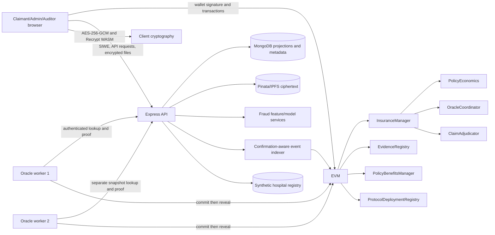

# Block-Insure Project Research Context

> **Purpose:** compact, research-ready context for literature search, thesis design, and external-model analysis.
>
> **Repository snapshot inspected:** 2026-08-27. Current source code, schemas, tests, generated artifacts, and build configuration take precedence over older prose.
>
> **Status labels:** **Implemented** = directly supported by current repository evidence; **Partial/experimental** = present but limited, synthetic, local-only, or incompletely evaluated; **Planned/gap** = not implemented; **Inferred** = plausible from surrounding code but not conclusively demonstrated.

## 0. Evidence basis and cautions

This document was produced from the complete repository structure, with detailed inspection of:

- Solidity contracts, interfaces, deployment scripts, Hardhat configuration, and contract tests under `contracts/`.
- Express routes/controllers/services, MongoDB schemas, model artifacts, evaluation results, and backend tests under `backEnd/`.
- React routes, wallet/authentication context, contract/API services, evidence cryptography utilities, and role dashboards under `frontEnd/`.
- Both oracle-worker logic, protocol helpers, cursor handling, and tests under `oracle/`.
- Root setup, launcher, preflight, synchronization, observability, and Playwright E2E tooling.
- `reference/block-insure-current-project-overview.md`, the much larger `reference/block-insure-deep-technical-reference.md`, all three reports in `reference/addition check/`, the paper collection, and the academic project templates.

Important provenance cautions:

- The deep technical reference is useful background, but executable code and current generated artifacts were used to resolve its claims.
- `docs/` currently contains only `protocol-v2-migration.json`; several Markdown documents linked by `README.md` and older references are absent.
- `backEnd/evaluation-results/phase5-evaluation.json` and `backEnd/model-params.json` describe the current v3 model. `risk-model-summary.json` is a legacy v2 study and must not be cited as the current runtime model.
- The three `addition check` reports are idea-generating literature reviews. Their citations and novelty claims have not been independently verified by this repository inspection.
- The PDFs currently stored in `reference/papers/` are mostly broad blockchain, access-control, DID, IPFS, IoT, and application papers; they do not yet form a focused, validated Block-Insure literature corpus.

## 1. Project identity and research problem

### 1.1 What Block-Insure is

Block-Insure is a thesis prototype for an Ethereum-compatible, hybrid health-insurance workflow. It combines:

- On-chain policy, claim, oracle-consensus, manual-adjudication, reserve, benefit, and payout state.
- Off-chain encrypted claim evidence and operational metadata.
- A versioned synthetic healthcare registry committed by Merkle roots.
- Two oracle workers using exact-result commit-reveal consensus.
- A calibrated Bernoulli Naive Bayes fraud-risk model used as advisory workflow intelligence.
- A deterministic four-auditor manual-review fallback and versioned appeal cycle.

The strongest defensible contribution is the **integration and joint evaluation of trust boundaries**, not the novelty of blockchain, Naive Bayes, AES-GCM, proxy re-encryption (PRE), or Merkle trees individually.

### 1.2 Real-world problem

Insurance claims require several parties to trust policy rules, submitted evidence, provider records, fraud analysis, decision authority, and the insurer's ability to pay. A conventional privileged database can make one operator the effective source of truth. Block-Insure investigates whether authority can be separated so that:

- Financial liabilities and lifecycle transitions are contract-verifiable.
- Sensitive medical documents stay off-chain and encrypted.
- External observations are version-bound and require exact multi-oracle agreement.
- Ambiguous or failed automatic verification is escalated to human auditors.
- Approved liabilities remain visible when treasury funding is insufficient.
- Operational projections can be reconstructed from authoritative events.

### 1.3 Stakeholders and roles

| Stakeholder | Current representation | Main interests/actions |
|---|---|---|
| Policyholder/claimant | `USER` application role and policy-owner wallet | Buy policy, pay premium, submit encrypted evidence and claim, appeal, withdraw settlement, manage beneficiaries/benefits. |
| Insurer/operator | Primarily `ADMIN` plus treasury and contract modules | Configure packages/rules, roles, registry snapshots, module funding, manual routing, and benefit confirmations. There is no separate `INSURER` application role. |
| Claims officer | `CLAIM_OFFICER_ROLE` on-chain | Can perform selected operational claim/oracle actions. **Partial:** no dedicated Mongo role or frontend workspace. |
| Assessor/auditor | `AUDITOR` application role plus `AUDITOR_ROLE` | Inspect assigned claims/evidence and cast one valid/invalid vote. |
| Oracle operator | `ORACLE` application/on-chain identity and API-key-authenticated worker | Reconstruct registry proof, assess claim facts, commit, reveal, and report health/logs. |
| Emergency operator | `EMERGENCY_ROLE` on-chain | Pause authority where configured. **Partial:** no dedicated application UI. |
| Provider/hospital | Synthetic Mongo registry records | Supplies the external record being committed and verified. **Experimental:** not a real provider integration. |
| Examiner/researcher | Evaluation artifacts and thesis dashboard | Reproduce metrics, inspect protocol evidence, and analyze limitations/trade-offs. |

### 1.4 Research motivation and expected contribution

The project can credibly investigate this question:

> Can a modular hybrid insurance architecture combine auditable financial state, confidential off-chain evidence, version-bound external verification, calibrated fraud triage, deterministic human appeal, and reserve-aware settlement without placing medical content on-chain?

Expected contributions supported or enabled by the repository are:

1. A complete cross-layer claims prototype with explicit authority boundaries.
2. Exact-result, version-bound oracle consensus rather than first-response or Boolean-majority settlement.
3. Browser-side encryption plus PRE-based delegated review and append-only evidence transparency.
4. A reproducible synthetic fraud-evaluation pipeline with calibration and leakage-aware grouping.
5. Contract-level coverage reservation, funding-required states, and pull-payment settlement.
6. A platform for controlled experiments across ML quality, oracle faults, security invariants, privacy overhead, gas, latency, and reserve adequacy.

The project does **not** currently establish clinical truth, production decentralization, legal/regulatory compliance, real-world fraud accuracy, or production solvency.

## 2. Current system architecture

### 2.1 Runtime architecture and data flow



Authority direction: the browser and backend initiate or prepare work; Solidity enforces lifecycle and money transitions; MongoDB is a repairable operational projection; the ML model recommends a route but cannot approve or pay a claim.

### 2.2 Components and technology stack

| Layer | Current implementation |
|---|---|
| Frontend | React 19, Vite 8, React Router 7, TanStack React Query 5, Ethers 6, Axios, Web Crypto, Recrypt WASM, MetaMask/EIP-1193 wallet. |
| Backend | Node.js, Express 5, Mongoose 9/MongoDB, Ethers 6, SIWE, JWT, Helmet, CORS, rate limiting, Multer, Axios, Pinata/IPFS integration, Recrypt Node binding. |
| Blockchain | Solidity 0.8.26, Hardhat 2.28, OpenZeppelin 5.6.1; optimized via IR for Cancun EVM. Native ETH is used for premiums, reserves, and payouts. |
| Oracle plane | Two configurable Node/Ethers/Axios worker processes, separate wallets/snapshots/cursors, authenticated backend queries, commit-reveal transactions. |
| Intelligence | Custom 18-feature Bernoulli Naive Bayes pipeline, Laplace smoothing, Platt/isotonic evaluation support, versioned/hashes model artifact. |
| Storage | MongoDB for users, projections, registry snapshots, attempts, logs, grants, and notifications; Pinata/IPFS for encrypted evidence bytes; chain for authoritative hashes/state/value. |
| Testing | Hardhat/Mocha/Chai, Node test runner, Playwright E2E, ESLint/build checks, synchronization/bytecode checks, optional Slither command. |

### 2.3 Authentication and authorization

**Implemented:**

1. Backend creates a short-lived, single-use SIWE nonce and message bound to domain, URI, chain ID, wallet, and resources.
2. Wallet signs the message; backend verifies signature, nonce, expiry, domain/URI, and chain ID.
3. Backend issues a JWT containing JTI, wallet, role, SIWE method, and chain context.
4. Middleware verifies signature, issuer, audience, expiry, JTI revocation, current user existence, current database role, and current on-chain role for privileged users.
5. Route middleware applies application roles; contracts independently enforce `AccessControl` roles and ownership/state preconditions.

Controls include CORS allowlists, Helmet, hidden production errors, nonce/login/claim rate limits, API keys for oracle endpoints, and a default 10 MB upload bound.

**Concern:** the browser stores the bearer JWT in `localStorage`, increasing XSS token-theft impact. The example environment documents `JWT_EXPIRES_IN`, while code uses `AUTH_SESSION_TTL_MS`; configuration naming is inconsistent.

### 2.4 Deployment reality

- **Implemented:** reproducible local Hardhat chain (`31337`) with MongoDB, backend, frontend, and two oracle workers.
- `npm run setup:local` resets only project runtime data, funds local accounts, deploys/wires modules, assigns one admin/four auditors/two oracles, creates a default package/benefit schedule, funds reserves, publishes a registry root, synchronizes addresses/ABIs, and verifies clean state.
- `npm run dev:all` combines backend, frontend, and two oracle processes after a valid chain/deployment exists; the Hardhat node remains a separate prerequisite.
- **Partial:** Hardhat contains a `sepolia` network entry, but there is no tracked Sepolia deployment script, CI/CD pipeline, production secret scheme, hosted database/storage topology, verified contract-address manifest, or evidence of a successful public-testnet deployment.
- **Not implemented:** production/mainnet/L2 deployment, managed KMS/HSM, production monitoring/SLA, disaster recovery, or regulatory operations.

## 3. Core workflows

### 3.1 Registration, login, and roles

- Requesting a nonce upserts a wallet-based `User`; first users default to `USER`.
- Optional profile fields are name, email, phone, and hashed NID.
- SIWE login returns the current stored role; logout persists the token JTI until expiry.
- Admin/auditor/oracle access is checked against current on-chain authority, limiting stale-token privilege after role revocation.
- Frontend workspaces exist for user, admin, and auditor. Oracle is a service identity, not a normal UI. Claim-officer and emergency roles are contract-only in the current application.

### 3.2 Package, policy, premium, and benefit management

1. Admin creates/updates/deactivates/reactivates a policy package.
2. `PolicyEconomics` can publish a strictly versioned rule schedule; a purchase snapshots applicable terms so later package changes do not silently rewrite an existing policy.
3. User purchases by paying the exact premium in native ETH. A coverage interval and waiting-period state are opened.
4. Default recurring premium interval is 30 days and grace is 7 days, capped by policy end. Payment can restore active status during grace; a lapsed policy can be reinstated under contract conditions.
5. Holder/admin can cancel under contract rules; expiry is timestamp-derived and lazily synchronized.
6. `PolicyBenefitsManager` separately supports versioned terms, up to three beneficiaries, death/surrender/maturity requests, administrative approve/reject/settle, a separately funded vault, and beneficiary pull withdrawal.

**Boundary:** benefit approval is intentionally administrative; ordinary claim approval is not an admin/backend decision.

### 3.3 Claim submission and document handling

1. Backend precheck validates user/wallet, policy, rate allowance, and a submission-attempt record.
2. Browser predicts/binds claim ID and version metadata, generates a random 32-byte AES key and IV, and encrypts the evidence with AES-256-GCM.
3. AES authenticated associated data binds claim ID, claim version, uploader identity, and evidence type. Payload format is marked `BINSENC2`.
4. AES key is encapsulated for the uploader's versioned Recrypt identity. Ciphertext is uploaded to Pinata/IPFS; MongoDB stores CID, ciphertext hash, envelope metadata, wrapped capsule, and evidence-chain metadata—not the raw AES key or intended plaintext.
5. Wallet calls `submitClaim`. Contract checks ownership, policy timing/status, incident time, non-empty identities, amount, document/invoice duplication, and a maximum of five claims per policy.
6. `PolicyEconomics` validates snapshotted terms, service/exclusion rules, document count, invoice uniqueness, remaining coverage, and reserves liability.
7. Backend records the transaction hash and reconciles receipt, indexed event, claim ID, and evidence attachment. Attempts can be `AUTHORIZED`, `UPLOADING`, `UPLOADED`, `TX_SUBMITTED`, `COMPLETED`, `ABANDONED`, or `FAILED`.

### 3.4 Fraud preview, oracle verification, and decision

1. Backend/registry comparison produces structural signals and a model risk probability. This is advisory.
2. An operational actor requests verification; manager creates a canonical query bound to claim/policy/facts/evidence/version/current registry snapshot/current model identity.
3. Coordinator snapshots eligible oracles, quorum, registry version/root, model version, and deadlines.
4. Each worker retrieves its configured synthetic registry snapshot, reconstructs the canonical SHA-256 leaf, verifies the Merkle proof/root, compares claim facts, creates a deterministic result hash, commits with a salt, then reveals.
5. Coordinator counts an **exact digest** including verdict, result hash, claim version, registry version/root, and model version.
6. Matching exact quorum finalizes verified or false. Complete disagreement becomes conflict; an expired request can be permissionlessly finalized as timeout. Conflict/timeout fail conservatively.
7. Verified result calculates settlement and moves to funded `PAYOUT_READY` or visible `FUNDING_REQUIRED`. Failed or fraud-flagged results become eligible for manual review.

### 3.5 Manual review, appeal, and payout

- A manual review snapshots exactly four active auditors using deterministic assignment.
- Each assigned auditor has one equal-weight vote: valid or invalid. Reputation is observed/displayed but **does not weight on-chain votes**.
- Three valid votes approve; two invalid votes reject immediately; expiry without approval rejects for insufficient quorum.
- Owner grants a selected auditor a Recrypt transform key. Backend transforms the capsule without learning the AES key; auditor verifies ciphertext receipt/AAD and decrypts in the browser.
- Approval follows the same settlement allocation path as oracle verification. Rejection releases reserved exposure.
- A claimant may appeal one rejected decision. The claim version increments, previous request/resolution fields are reset, exposure is re-reserved, and the next oracle result must bind the new version.
- For an adequately funded claim, value moves into the adjudicator payout vault and the claimant performs a non-reentrant pull withdrawal. Withdrawal settles the economics reservation and sets `SETTLED`.
- If underfunded, liability remains in `FUNDING_REQUIRED`; after treasury funding, anyone may call activation when conditions are met. Admin cannot alter the already calculated amount.

### 3.6 Main state transitions

```text
SUBMITTED -> DUPLICATE_CHECKED or FRAUD_FLAGGED
DUPLICATE_CHECKED/APPEALED -> ORACLE_PENDING
ORACLE_PENDING -> ORACLE_VERIFIED -> PAYOUT_READY or FUNDING_REQUIRED
ORACLE_PENDING -> ORACLE_FAILED -> MANUAL_REVIEW
FRAUD_FLAGGED -> MANUAL_REVIEW
MANUAL_REVIEW -> PAYOUT_READY, FUNDING_REQUIRED, or REJECTED
FUNDING_REQUIRED -> PAYOUT_READY -> SETTLED
REJECTED -> APPEALED -> ORACLE_PENDING
```

`CLOSED` exists in the enum/event surface but no active current transition assigns it.

## 4. Smart-contract and blockchain details

### 4.1 Contract responsibilities

| Contract | Purpose and key entities/functions | Authority and notable events | Current limitations |
|---|---|---|---|
| `InsuranceManager` | Packages, policies, claims, documents, claim versions, model identity, oracle/manual routing, funding activation, settlement withdrawal. | `ADMIN_ROLE`, `CLAIM_OFFICER_ROLE`, `ORACLE_ROLE`, `AUDITOR_ROLE`, `EMERGENCY_ROLE`; coordinator-only oracle finalization; adjudicator-only manual finalization. Emits package/policy/claim/oracle/appeal/funding/settlement events. | 24,262 deployed bytes against 24,576 EIP-170 limit: only 314 bytes headroom. `CLOSED` unreachable. Substantial new logic should be a separate module or off-chain. |
| `PolicyEconomics` | Versioned package rules and immutable policy-term snapshots; coverage intervals; validation/reservation/release/settlement; invoice uniqueness; solvency calculations. | Manager-only claim accounting; manager-admin config. Emits rule, terms, interval, reservation, release, settlement, warning, and funding-attribution events. | Reserve floor is deterministic, not an actuarially estimated solvency model. Default reserve ratio 500 bps and buffer 0.1 ETH are demo parameters. |
| `OracleCoordinator` | Historical registry snapshots, request/eligibility snapshots, commitments, reveals, exact-digest counts, conflict/timeout finalization. | Manager creates requests/configures active oracles; eligible worker commits/reveals; timeout resolution is permissionless. Defaults: quorum 2, 25-block commit and 25-block reveal windows. | Two operator-controlled workers do not establish independent sources, Byzantine tolerance, Sybil resistance, incentives, or truthful input data. |
| `ClaimAdjudicator` | Four-seat reviews, assignments, equal votes, decisions, one appeal, payout allocations/withdrawals, reputation observations. | Manager opens/finalizes; assigned auditors vote; claimant withdrawal is routed by manager. Defaults: 3-day review, 2-day routing delay, maximum one appeal. | Reputation is retrospective Beta-smoothed display/analysis, not a robust reputation or incentive protocol. Fixed four-auditor assumption may not scale. |
| `EvidenceRegistry` | Versioned Recrypt public identities/revocation and monotonic signed evidence-tree-head anchors. | Users manage their identity; configured signer anchors heads; manager admin changes signer. | Does not store evidence or enforce ciphertext deletion. Revocation cannot erase keys/plaintext already obtained. Signer custody is a trusted operational dependency. |
| `PolicyBenefitsManager` | Versioned benefit terms, beneficiaries, death/surrender/maturity requests, approval/rejection/allocation/withdrawal, separate reserve. | Insurance admin confirms decisions/funding; holder/beneficiary requests; recipients withdraw. | Administrative benefit verification is not oracle/auditor based; real death/maturity evidence validation is absent. |
| `ProtocolDeploymentRegistry` | Component addresses, interface versions, protocol identity, migration-manifest hash. | Immutable administrator records deployment identity. | Reproducibility registry, not a proxy-upgrade mechanism; no public-network deployment evidence. |
| `GasTestContract` | Compares storing individual hashes with one Merkle root. | Experimental only. | Measures a narrow storage trade-off, not complete application performance or availability. |

### 4.2 Important formulas and invariants

Deterministic settlement uses integer arithmetic:

```text
deductible = min(claimAmount * deductibleBps / 10,000,
                 deductibleCap, claimAmount)
afterDeductible = claimAmount - deductible
insurerPays = afterDeductible * insurerShareBps / 10,000
claimantResponsibility = claimAmount - insurerPays
```

Protected manager balance is conceptually:

```text
approvedUnfundedLiability
+ minimumCapitalBuffer
+ activeExposure * reserveRatioBps / 10,000
```

Core intended invariants include:

- An old claim version, registry root, or model version cannot finalize a new cycle.
- One exact result digest must reach the snapshotted quorum.
- Only coordinator/adjudicator can finalize their respective paths.
- One assigned auditor casts at most one vote per claim version.
- Coverage is reserved once and either released or settled.
- Allocated payout equals withdrawn plus remaining pull balance; no double withdrawal.
- Excess treasury withdrawal cannot breach protected reserve.
- Evidence acceptance requires ciphertext hash, expected AAD, `BINSENC2`, and AES-GCM authentication.

### 4.3 On-chain versus off-chain data

| On-chain | Off-chain/browser | Reason/boundary |
|---|---|---|
| Package/policy terms and status, claim facts/status/amount, reservations, liabilities, votes, decisions, payouts. | Rich profiles, transaction attempts, dashboards, notifications, logs, projections. | Money and authority are auditable; query convenience remains off-chain. |
| Registry version/root/tree metadata and oracle commitments/reveals. | Synthetic records, historical leaves/proofs, worker health/cursors. | Root commits to data but does not preserve or prove external truth. |
| Evidence CID/hash references, encryption identities, signed tree-head roots. | Ciphertext on IPFS; metadata/capsules/grants/logs in Mongo; private identity/AES operations in browser. | Medical bytes and decryption secrets should not be public or immutable on-chain. |
| Model identity hash/version bound to requests. | Features, artifact coefficients/probabilities, evaluation datasets/results. | Reproducibility without publishing sensitive features in transactions. |

### 4.4 Blockchain concerns

- **Security:** privileged admin configuration, upgrade-by-redeployment, module wiring, oracle collusion, compromised tree-head signer, and development dependency risk remain trust points. Tests are not a formal proof or independent audit.
- **Privacy:** public wallets, claims, timing, amounts, CIDs/hashes, and access events can enable linkage even when documents are encrypted. Immutable metadata can itself be sensitive.
- **Scalability/cost:** several transactions are needed per claim (submission, request, commits, reveals, possible votes, allocation, withdrawal). Local auto-mining measurements do not predict public-chain fees/finality.
- **Usability:** users need a wallet, correct chain, ETH, browser key state, evidence backup, and several confirmations. Recovery and error handling are complex.
- **Maintainability:** manager bytecode headroom is effectively exhausted; module/interface/migration discipline is mandatory.

## 5. Fraud detection, verification, and intelligence

### 5.1 Implemented fraud-risk pipeline

The current runtime artifact is `bernoulli-fraud-v3.0.0`, feature schema `fraud-features-v3`, threshold `0.5`, Laplace alpha `1`, and Platt calibration fitted on a 120-record latest-temporal validation partition. Training uses 480 records: 49 fraud and 431 legitimate.

The 18 binary features are:

```text
clean_registry_match, registry_record_missing, hospital_id_mismatch,
invoice_hash_mismatch, claim_exceeds_registry_bill, bill_range_anomaly,
treatment_type_mismatch, date_mismatch, invalid_record_status, used_invoice,
cancelled_record, license_suspended, license_blacklisted,
repeat_claim_pattern, provider_velocity_anomaly, claimant_velocity_anomaly,
near_duplicate_advisory, missing_or_noisy_record
```

Current workflow bands are low `<0.35`, medium `0.35-<0.70`, and high `>=0.70`. Conceptual recommendation policy:

```text
blocking comparison failure                         -> reject automatic verification
non-fuzzy probability >= 0.85                      -> reject automatic verification
fuzzy-only signal or probability >= 0.50           -> recommend manual review
otherwise                                           -> recommend automatic verification
```

The score is a **fraud-risk/review-priority signal**, not proof of fraud. The final chain outcome comes from exact oracle consensus or manual adjudication.

### 5.2 Existing evaluation evidence

- Four seeded synthetic profiles, 600 records each: normal, high-fraud, provider-compromise, temporal-shift.
- Five folds and seeds 11/29/47; connected claimant-provider components are grouped to reduce entity leakage.
- Calibration is fitted within training folds; Platt and isotonic candidates can be compared using validation Brier score.
- Aggregate recorded means: accuracy `0.9113`, precision `0.4481`, recall `0.2177`, F1 `0.2869`, ROC-AUC `0.8875`, PR-AUC `0.5774`, Brier `0.0640`, calibration error `0.0644`.
- Temporal holdout (120 records): TP 16, TN 81, FP 5, FN 18; accuracy `0.8083`, precision `0.7619`, recall `0.4706`, F1 `0.5818`, ROC-AUC `0.80284`, PR-AUC `0.647515`, Brier `0.1529`.
- Recorded attack checks report no fuzzy-only automatic rejection and no connected-group leakage in the generated experiments.

These numbers are synthetic methodology evidence, not estimates of deployment performance. Low aggregate recall and temporal calibration degradation are important findings, not details to hide.

### 5.3 Verification/intelligence beyond ML

**Implemented rule/protocol intelligence:** exact document/invoice duplicate checks, wallet/date/type uniqueness, maximum claims per policy, policy/economic eligibility, provider/license/record-state checks, amount/date/treatment comparison, Merkle inclusion verification, oracle version binding, manual auditor quorum, derived auditor outcome statistics, reserve/funding intelligence, and reorg-aware audit indexing.

**Absent or incomplete research mechanisms:**

- No external real claims dataset validation, prospective study, clinician/insurer labeling, fairness audit, or demographic subgroup evaluation.
- No cost-sensitive threshold tied to false-negative/false-positive cost and four-auditor capacity.
- No logistic/boosted-tree/graph/anomaly baseline integrated into the current v3 study.
- No SHAP/counterfactual explanation pipeline; current feature flags are interpretable but not a complete XAI evaluation.
- No OCR, document-layout model, medical-code validation, digital-signature verification, or automated comparison of document contents with claim facts.
- No real hospital/FHIR/claims API, trusted execution, decentralized oracle network, or cryptographic proof of source provenance.
- No oracle incentive/slashing, source-diversity rule, calibrated reliability model, or explicit correlated-error simulation.

## 6. Data model and privacy

### 6.1 Important entities and relationships

```text
User(wallet, role, profile, encryption identity)
  owns -> on-chain Policy -> snapshots PackageRules/BenefitTerms
  submits -> ClaimSubmissionAttempt -> on-chain Claim(version)
  uploads -> File(ciphertext metadata, CID, hash, AAD binding)
Claim(version)
  has -> EvidenceEvent chain -> EvidenceTreeHead -> on-chain anchor
  has -> OracleRequest -> commitments/reveals/logs/health
  may have -> ManualReview -> four votes -> DecisionRecord/reputation observations
  may have -> Appeal metadata and new claim version
  may produce -> CoverageReservation -> Settlement -> payout withdrawal
File -> EvidenceGrant(owner, grantee, transform key, key version, revocation)
File -> EvidenceAccessLog(grant/revoke/retrieve/transform)
Synthetic Registry -> canonical leaves/proofs -> versioned on-chain Merkle root
Indexer -> IndexedBlock/Event/Checkpoint -> audit timeline and notifications
```

Mongo models include `User`, `RevokedToken`, `File`, `EvidenceEvent`, `EvidenceTreeHead`, `EvidenceGrant`, `EvidenceAccessLog`, `ClaimSubmissionAttempt`, `Appeal`, `AdminActionLog`, `OracleLog`, `OracleHealth`, two mock-registry collections, `VotingFinalization`, `Notification`, `IndexedBlock`, `IndexedBlockchainEvent`, and `IndexerCheckpoint`.

### 6.2 Sensitive data

- Direct profile data: name, email, phone, wallet address.
- Identity-derived data: hashed NID, patient hash, claimant/family/provider identifiers.
- Financial/behavioral data: policy choice, premium timing, claim amount/type/date/status, fraud features/scores, appeal reasons, benefits and beneficiaries.
- Medical evidence: original document content (browser plaintext), encrypted payload, original filename/MIME type, CID/hash, claim binding, access metadata.
- Security data: JWT, wallet signatures, encryption public/private identities, wrapped AES capsule, transform grants, oracle/admin private keys and API credentials in ignored environments.

### 6.3 Protections currently implemented

- Client-side AES-256-GCM with authenticated claim/version/uploader/type binding.
- Random per-file AES key; no intended plaintext AES key persistence in backend, IPFS, or chain.
- Recrypt PRE for recipient-specific delegated key access without backend plaintext decryption.
- Versioned public encryption identities and revocation; browser private identity in IndexedDB with wallet-signature-derived encrypted backup.
- Ciphertext SHA-256 receipt, CID, per-claim evidence hash chain, RFC6962-style inclusion/consistency proofs, signed tree heads, and on-chain anchoring.
- SIWE nonce consumption, JWT issuer/audience/JTI revocation, current-role checks, API rate limits, bounded MIME types/files, and secret templates.
- Confirmation-aware, rollback-capable event indexing; blockchain events remain authoritative over Mongo projections.

### 6.4 Privacy/security gaps

- `localStorage` JWTs are vulnerable to successful XSS; no HttpOnly cookie/session-binding design is implemented.
- No repository evidence of a formal PII classification, consent/retention/deletion policy, data-protection impact assessment, breach plan, or jurisdiction-specific compliance analysis.
- Hashing alone may not anonymize low-entropy NID/patient identifiers; the hashing/pepper governance for `hashedNid` is not evidenced.
- Wallet addresses, claim facts, amounts, timing, hashes/CIDs, and public events remain linkable and immutable.
- Original filenames and metadata can leak meaning even when bytes are encrypted.
- Pinata/IPFS availability, unpinning, replication, gateway privacy, and long-term ciphertext retention are operational dependencies.
- PRE grant revocation blocks future authorized transformations but cannot revoke plaintext or a recovered key already copied by a recipient.
- Browser IndexedDB/wallet backup is not HSM-grade custody; loss of wallet and backup can make evidence permanently inaccessible.
- Backend-held proxy signing material requires managed KMS/HSM and a documented release policy in production.
- MongoDB encryption at rest, field-level encryption, TLS topology, backups, and least-privilege database roles are not demonstrated in tracked configuration.
- Synthetic hospital data avoids real patient exposure but cannot validate production privacy behavior or attacker incentives.

## 7. Current implementation status

### 7.1 Completed and repository-supported

- Seven modular contracts are implemented and locally wired: manager, economics, coordinator, adjudicator, evidence registry, benefits manager, and deployment registry.
- Package/policy/premium lifecycle; versioned economic rules; coverage reservations; deterministic settlement; funding-required state; pull payouts.
- Claim submission, duplicate/eligibility checks, exact oracle commit-reveal, conservative conflict/timeout handling, manual review, one appeal, and version replay protection.
- Browser AES-GCM evidence encryption, PRE grant/transformation flow, identity revocation, evidence receipt/hash chain, signed transparency heads, and on-chain anchors.
- Synthetic registry generation, canonical Merkle tree/proofs, historical snapshots, two worker configurations, cursors, retry/idempotency behavior, heartbeats, and logs.
- SIWE/JWT authentication, application/on-chain role checks, route controls, rate limits, transaction reconciliation, notifications, audit exports, and reorg-aware indexing.
- User/admin/auditor React workspaces and a thesis-results dashboard.
- Reproducible model/dataset/evaluation scripts and machine-readable research metrics.
- Current full verification: 124 passing Solidity tests, 38 passing backend tests, passing frontend lint/build, and 9 passing oracle tests. Six Playwright E2E tests are also defined but require a prepared live stack and are outside `verify:all`.

### 7.2 Partial or experimental

- All external clinical truth is synthetic; the two oracle snapshots are operationally separated but can share generator, code, infrastructure, and operator.
- Fraud evaluation is reproducible and calibrated but entirely synthetic; model recall and temporal calibration require improvement.
- Auditor reputation is recorded/derived but not used for assignment weighting, incentives, or Byzantine defense.
- Benefits workflows exist, but death/surrender verification is administratively confirmed rather than independently automated.
- Evidence confidentiality is technically implemented, but key custody, metadata privacy, availability, revocation semantics, and production operations remain unvalidated.
- Indexer/throughput artifacts include microbenchmarks and an older local workload; recorded oracle decision latency was unavailable because finalized runtime logs were absent.
- Playwright covers public health, role isolation, four auditors, and one purchase/submission workflow, but needs a live prepared stack and is not included in `verify:all`.
- Sepolia configuration is a starting point only, not a deployed system.

### 7.3 Missing, broken, or uncertain

- No production/testnet deployment evidence, container/orchestrator configuration, CI workflow, public endpoints, monitoring backend, key manager, or infrastructure-as-code.
- No real insurer/provider integration, payment gateway/stablecoin/fiat accounting, KYC credential verification, or decentralized identity credential flow.
- No actuarial pricing/reserving model, reinsurance, capital optimization, or regulatory-solvency analysis.
- No real-world fraud dataset, external validation, fairness analysis, human-reader study, or model-monitoring/drift response.
- No automated semantic document verification or real oracle-source provenance.
- No independent security audit or formal verification. Slither is optional; Forge/Echidna/model checking are not established toolchain requirements.
- `CLOSED` claim status is dead/unreachable state in current transitions.
- README/documentation links are stale because referenced security/methodology Markdown files are absent from `docs/`.
- Legacy v2 and current v3 evaluation artifacts coexist and can lead to accidental metric/model misreporting.
- Environment naming mismatch: documented `JWT_EXPIRES_IN` is not the session-TTL variable consumed by authentication code.
- The tracked repository does not provide enough evidence to assert production Mongo/IPFS durability, disaster recovery, or secret hygiene beyond ignored environment templates.

### 7.4 Verification snapshot

`npm run verify:sync` passed on 2026-08-27. It confirmed synchronized ABI copies, four core service-address settings, model/oracle configuration, and deployed-bytecode sizes:

| Contract | Deployed bytes | EIP-170 limit |
|---|---:|---:|
| InsuranceManager | 24,262 | 24,576 |
| OracleCoordinator | 7,014 | 24,576 |
| ClaimAdjudicator | 10,818 | 24,576 |
| PolicyEconomics | 9,484 | 24,576 |
| EvidenceRegistry | 4,135 | 24,576 |
| ProtocolDeploymentRegistry | 923 | 24,576 |
| PolicyBenefitsManager | 9,981 | 24,576 |

Recorded Solidity coverage artifact: statements `93.64%`, functions `90.00%`, lines `94.29%`, branches `64.51%`. Branch coverage is the clearest coverage weakness. The synchronization result is current; other recorded test/coverage metrics are artifacts and should be rerun before thesis submission.

`npm run verify:all` also passed on 2026-08-27: 124 Solidity tests, backend analytics plus 38 unit tests, frontend lint and production build, and 9 oracle tests. The six live-stack Playwright tests were not run by that command.

## 8. Prioritized research opportunities

The rankings favor additions that connect directly to current gaps, can be evaluated rigorously, and do not require expanding the nearly full manager contract.

### 8.1 Rank 1 — Cost-aware, auditor-capacity-constrained fraud triage

- **Relevance:** directly extends the current calibrated advisory model and fixed four-auditor fallback; aggregate recall is currently low.
- **Expected benefit:** converts a generic probability threshold into an insurance decision policy balancing missed fraud, false accusations, and limited review capacity.
- **Implementation difficulty:** medium. Keep scoring off-chain; bind only model/threshold identity or decision hash to the request. Avoid new manager fields unless placed in a module.
- **Required data/tools:** existing synthetic profiles first; preferably a legally usable public claims/provider-fraud proxy dataset; logistic regression and gradient-boosted-tree baselines; calibration; bootstrap analysis. Clinical/PII features should be excluded or governed.
- **Academic evaluation:** minimize
  `C_FN*FN + C_FP*FP + C_review*N_review` subject to `N_review <= B`; report PR-AUC, recall/precision at capacity, F-beta, MCC, Brier/ECE, expected cost, calibration curves, temporal/provider-held-out results, and ablations.
- **Originality angle:** a calibrated score connected to a human-review capacity and immutable claim workflow, rather than classifier accuracy alone.

### 8.2 Rank 2 — Fault-aware, source-diversity-aware oracle evaluation

- **Relevance:** the exact commit-reveal protocol is strong against copying/replay but has only two potentially correlated sources.
- **Expected benefit:** quantifies when quorum helps, when it only duplicates the same error, and when disagreement should route to auditors.
- **Implementation difficulty:** medium for simulation/fault injection; medium-high for 3–5 workers, signed source attestations, or reliability-aware aggregation. Preserve exact binding and preferably equal safety thresholds.
- **Required data/tools:** Monte Carlo/adversarial simulator; strategies for independent noise, correlated source failure, collusion, stale roots, downtime, withholding, invalid reveal, and Sybil identities; multiple oracle instances/snapshots.
- **Academic evaluation:** attack-success probability, false approval/rejection, conflict/escalation rate, time-to-finality, gas per oracle, availability, and reliability convergence across seeds and correlation levels.
- **Originality angle:** experimentally separate transport/process redundancy from true source independence. Treat reputation cautiously; current auditor reputation must not be described as weighted voting.

### 8.3 Rank 3 — Invariant, mutation, and adversarial state-machine assurance

- **Relevance:** funds depend on multi-contract sequences; current statement coverage is high but branch coverage is 64.51%, and one dedicated stateful test file is not exhaustive.
- **Expected benefit:** demonstrates that tests detect realistic settlement, replay, access-control, timeout, appeal, and reserve faults.
- **Implementation difficulty:** low-medium for more stateful/fuzz/mutation tests; high for formal model/refinement proof.
- **Required data/tools:** Hardhat plus Foundry/Echidna or equivalent, Slither, mutation tooling, malicious receiver contracts, generated call sequences; optionally TLA+/Alloy/Certora-style specifications.
- **Academic evaluation:** invariant catalogue, transition coverage, branch coverage, mutation score, violations found, time-to-detection, false positives from analyzers, and gas overhead of guards.
- **Originality angle:** insurance-specific cross-contract safety properties (coverage conservation, one finalization, version binding, funded allocation, and withdrawal conservation), not merely a vulnerability scan.

### 8.4 Rank 4 — Actuarial reserve-adequacy and stress controller

- **Relevance:** current reserve logic is a fixed 5% exposure ratio plus 0.1 ETH buffer, not a statistically justified reserve.
- **Expected benefit:** turns `FUNDING_REQUIRED` into an experimentally defensible solvency/liquidity mechanism and adds meaningful numerical content.
- **Implementation difficulty:** medium. Compute scenarios off-chain and commit signed/versioned reserve snapshots in a new module or deployment record; do not enlarge the manager.
- **Required data/tools:** transparent synthetic exposure/claim histories or a suitable public frequency-severity dataset; Poisson/negative-binomial frequency, Gamma/lognormal severity, Monte Carlo stress testing; optional dependence/catastrophe scenarios.
- **Academic evaluation:** insolvency probability, expected shortfall/VaR, unpaid approved claims, settlement delay, capital utilization, reserve coverage ratio, sensitivity to claim frequency/severity/tail/dependence and funding policy.
- **Originality angle:** connect actuarial uncertainty to auditable on-chain settlement gating. Mack chain ladder is only appropriate if credible development-triangle data can be constructed; frequency-severity simulation is more immediately feasible here.

### 8.5 Rank 5 — Privacy and evidence-lifecycle benchmark

- **Relevance:** AES-GCM, PRE, identity versions, revocation, proofs, and anchors already exist but lack a complete performance/privacy study.
- **Expected benefit:** quantifies confidentiality/integrity overhead and clarifies what revocation, key rotation, retention, and provenance actually guarantee.
- **Implementation difficulty:** medium. Most core mechanisms exist; add controlled benchmark harnesses, metadata minimization, explicit lifecycle rules, and possibly forward-secure key epochs.
- **Required data/tools:** synthetic PDF/image corpus across sizes; multiple recipients/key versions; Pinata/local IPFS; browser/backend timing; threat cases for tampering, moved AAD, stale grant, key loss, and already-decrypted copies.
- **Academic evaluation:** encryption/decryption/PRE/upload/retrieval/proof latency, ciphertext expansion, gas, proof size, tamper-detection rate, revocation/key-rotation cost, availability failure, and metadata leakage analysis.
- **Originality angle:** auditable relationship among evidence version, access grant, tree head, claim version, and decision while plaintext remains off-chain.

### 8.6 Rank 6 — Verifiable credentials and decentralized role/provider identity

- **Relevance:** SIWE proves wallet control, not that a wallet is a licensed hospital, assessor, claimant, or beneficiary. Admin role grants remain centralized.
- **Expected benefit:** strengthens provider and professional identity, reduces manual role onboarding, and improves revocation auditability.
- **Implementation difficulty:** medium-high; legal issuer/governance design is harder than DID syntax.
- **Required data/tools:** W3C DID/Verifiable Credentials, test issuer, status/revocation list, wallet presentation flow, mock hospital/auditor credentials; selective disclosure only if scope permits.
- **Academic evaluation:** issuance/presentation/revocation latency, verification cost, privacy/linkability, stale-credential rejection, usability, and comparison with the current admin allowlist.
- **Originality angle:** bind external professional authorization to the existing registry/oracle/evidence workflow. A DID alone is not a contribution without issuer trust and revocation evaluation.

### 8.7 Rank 7 — Automated claim-document verification

- **Relevance:** encrypted files are integrity-checked but their medical/invoice contents are not machine-validated.
- **Expected benefit:** reduces manual effort and creates a richer link between document evidence, claim facts, and registry records.
- **Implementation difficulty:** high because privacy-preserving inference, OCR error, multilingual documents, labels, and ground truth are significant.
- **Required data/tools:** consented or synthetic invoice/discharge-summary documents, OCR/layout model, field extraction, medical/billing code rules, digital-signature/QR verification, confidence calibration, human review.
- **Academic evaluation:** field-level precision/recall/F1, document authenticity/tamper detection, calibration/abstention, reviewer time saved, failure by document quality/language, and privacy/latency overhead.
- **Originality angle:** confidence-aware automated verification that abstains to auditors and commits only non-sensitive result hashes.

### 8.8 Rank 8 — Public-testnet/L2 scalability and interoperability study

- **Relevance:** current performance is local-chain only and each claim requires multiple transactions.
- **Expected benefit:** establishes realistic cost/finality/usability limits and may reduce deployment friction that currently discourages testing.
- **Implementation difficulty:** medium for Sepolia automation; medium-high for L2 comparison or cross-chain interoperability.
- **Required data/tools:** deployment scripts, faucet-funded role wallets, CI secrets, explorer verification, Sepolia and one EVM L2 testnet, workload replay, gas-price snapshots, failure/retry telemetry.
- **Academic evaluation:** gas/fiat-equivalent cost, confirmation/finality latency, end-to-end throughput, failure rate, RPC/oracle availability, reorg behavior, and user steps across networks.
- **Originality angle:** evaluate the integrated multi-transaction claim lifecycle, not only isolated contract calls. Avoid calling a faucet-funded testnet production evidence.

### 8.9 Defer unless data/time justify them

- Full zero-knowledge medical-claim proofs: high novelty but high circuit/data/oracle complexity; start with one narrow predicate only.
- Graph neural networks: useful only with defensible claimant-provider-network data and leakage-safe entity splits.
- GAN-generated fraud: synthetic realism and evaluation are difficult; not automatically better than transparent scenario generators.
- CP-ABE replacement: may duplicate current PRE functionality; evaluate a narrow policy need first.
- Reputation-weighted voting/tokenomics: two fixed workers and four auditors do not naturally justify complex staking or peer-prediction incentives.
- DeFi insurance tranches/tokenized reserves: large scope and regulatory/economic risk, weakly connected to the current core research question.

## 9. Paper-writing and evaluation guidance

### 9.1 Suitable research questions and hypotheses

**Primary recommended thesis scope:** cost-aware fraud triage + adversarial oracle evaluation + state-machine assurance, using evidence/reserve modules as evaluated system components rather than attempting every extension.

| Research question | Example falsifiable hypothesis | Evidence availability |
|---|---|---|
| RQ1: Does calibrated, capacity-aware triage improve review decisions over fixed thresholds? | H1: At the same auditor budget, calibrated cost-aware ranking increases recall@B and lowers expected decision cost versus the current `0.5` threshold/rule baseline. | Existing synthetic pipeline can measure a first result; credible external claims require a new dataset. |
| RQ2: How robust is exact commit-reveal under correlated and malicious oracle faults? | H2: Exact quorum reduces single-worker false settlement but loses availability as error correlation rises; conservative manual escalation bounds unsafe approvals better than first-response or simple majority. | Requires new simulator/fault injection; current coordinator supplies the treatment implementation. |
| RQ3: Do stateful invariants reveal faults missed by unit tests? | H3: State-sequence fuzzing plus mutation testing detects a significantly larger fraction of seeded settlement/replay/access faults than unit tests alone. | Contracts/tests exist; mutation/fuzz harness must be expanded. |
| RQ4: What privacy/performance cost does the evidence lifecycle add? | H4: AES-GCM+PRE+Merkle anchoring detects substitution and enables delegated access with acceptable latency for typical document sizes, but revocation and availability remain operational limits. | Core flow/tests exist; benchmark corpus and runtime measurements needed. |
| RQ5: Does a stochastic reserve rule reduce underfunded approved claims? | H5: A frequency-severity reserve floor lowers simulated insolvency probability versus fixed-ratio reserve at a measurable capital-utilization cost. | Requires new model/data/simulation and preferably a separate reserve module. |

### 9.2 Methodology options

1. **Design-science/system study:** define requirements and threat model; implement the modular artifact; demonstrate traceable workflows; evaluate correctness, utility, and trade-offs.
2. **Controlled comparative experiment:** compare explicit baselines and treatments under identical synthetic/public datasets, seeds, chain settings, and hardware.
3. **Adversarial simulation:** generate oracle/provider/claimant faults with controllable independence, correlation, collusion, delay, and prevalence.
4. **Security evaluation:** state-machine model, invariant tests, mutation testing, static analysis, and manual triage. Do not call testing “formal verification” unless a sound formal tool and specified properties are used.
5. **Mixed-method extension:** small expert/usability study with claims professionals or students, if ethical approval and recruitment are realistic; measure decision time, correctness, confidence, and explanation usefulness.

### 9.3 Baselines

- Fraud: current rule+Bernoulli model; rule-only; uncalibrated Bernoulli/logistic; calibrated logistic; class-weighted logistic; gradient-boosted tree; random/top-risk review allocation.
- Oracle: first response; no commit-reveal; two-worker exact quorum; simple majority for 3/5 workers; source-diversity/reliability policy; always-escalate safety baseline.
- Security: unit tests only; unit+stateful fuzz; unit+fuzz+mutation; analyzer combinations.
- Evidence: plaintext/local baseline for timing only; encrypted IPFS; encrypted+receipt; encrypted+Merkle; encrypted+PRE+revocation.
- Reserve: balance-only; current fixed ratio; frequency-only; frequency-severity; stress-adjusted policy.
- Deployment: local Hardhat; Sepolia; one L2 testnet, with identical logical workflow.

### 9.4 Metrics

| Area | Primary metrics |
|---|---|
| Fraud/triage | PR-AUC, ROC-AUC, precision, recall, F1/F-beta, MCC, confusion counts, recall/precision@B, expected cost, Brier score, ECE, calibration slope/intercept, subgroup/provider/temporal stability. |
| Oracle | False approval/rejection, attack success, exact-consensus/conflict/timeout/escalation rates, availability, latency, gas, result divergence, reliability convergence. |
| Contracts | Invariant violations, transition/branch coverage, mutation score, analyzer true/false positives, gas and bytecode size, double-finalization/withdrawal attempts blocked. |
| Evidence/privacy | Tamper/AAD substitution detection, encryption/PRE/decryption/proof latency, proof/ciphertext size, gas, access/revocation failures, availability, metadata leakage. |
| Economics | Insolvency probability, expected shortfall, reserve coverage, unpaid liabilities, settlement delay, capital utilization, premium/reserve sensitivity. |
| System | p50/p95/p99 latency, throughput, error/retry rate, confirmation/finality time, reorg recovery, CPU/memory, RPC/IPFS availability, user interaction count. |

Use repeated seeds, uncertainty intervals, and paired/bootstrap or non-parametric comparisons where assumptions require. Report both effect size and uncertainty; do not choose thresholds on test data.

### 9.5 Experiment matrix

| Experiment | Independent variables | Outputs |
|---|---|---|
| Fraud capacity/cost | Model, prevalence, split, threshold, false-decision costs, auditor budget | PR/calibration curves, cost-capacity frontier, confusion matrices, ablation table. |
| Oracle faults | Worker count, quorum, independent/correlated error, collusion, delay, source diversity | Attack heatmap, escalation/availability curve, latency/gas table. |
| Contract assurance | Test strategy, mutation type, call sequence length, caller, timestamp boundary | Invariant catalogue, mutation matrix, coverage and detection table. |
| Evidence lifecycle | File size/type, tree size, recipients, key epoch, revocation, gateway failure | Sequence diagram, latency/size plots, tamper/revocation results. |
| Reserve stress | Frequency/severity distribution, tail, correlation, reserve rule, funding delay | Reserve trajectories, insolvency/shortfall curves, sensitivity heatmap. |
| Deployment scale | Network, concurrency, claim path, oracle count, confirmation depth | Cost/latency boxplots, throughput/failure table, bottleneck analysis. |

### 9.6 Recommended tables and figures

1. Architecture and trust-boundary diagram.
2. Contract/module responsibility and authority matrix.
3. Claim, oracle, evidence, and funding state/sequence diagrams.
4. On-chain/off-chain data and threat/control matrix.
5. Fraud feature dictionary and leakage-prevention protocol.
6. Dataset profiles, class prevalence, entity overlap, and split chronology.
7. Model baseline/ablation table with confidence intervals.
8. Precision-recall, calibration, threshold-cost, and review-capacity curves.
9. Oracle fault/attack heatmap and latency-versus-quorum plot.
10. Invariant-to-test/mutation traceability table.
11. Gas, bytecode, p95 latency, and throughput plots by workflow.
12. Evidence latency/size/revocation table.
13. Reserve trajectory and insolvency sensitivity figures.
14. Limitations and internal/external/construct/conclusion-validity table.

### 9.7 What can be measured now versus what needs new work

**Measurable with the current repository after rerunning the stack:** contract correctness/coverage/size/gas; root-versus-hash storage; policy/claim/oracle/auditor state paths; synthetic model discrimination/calibration/temporal behavior; browser evidence tamper resistance; proof size/time; role isolation; local claim throughput; indexer/reorg behavior; funding-required/withdrawal behavior.

**Needs additional implementation or data:** public-testnet cost/finality; real provider/oracle independence; external fraud validity/fairness; cost-capacity triage; oracle correlated-fault/collusion study; rigorous mutation/formal analysis; full evidence lifecycle benchmark; actuarial reserve adequacy; OCR/document semantics; DID/VC governance; professional usability study; production privacy/compliance claims.

### 9.8 Claims the thesis should avoid

- “Blockchain guarantees true claims,” “two oracles are decentralized truth,” or “the backend/model approves claims.”
- “Encrypted IPFS is anonymous,” “hashing removes PII,” or “revocation erases already disclosed plaintext.”
- “High accuracy proves fraud detection” or any production generalization from synthetic labels.
- “Formally verified” when only unit/stateful tests or static analyzers were used.
- “Solvent” when only a configured reserve ratio/balance gate was evaluated.
- “Deployed” without naming the network, addresses, block, code identity, and operational evidence.

## 10. Research Brief for External Models

### Project summary

Block-Insure is a local, Ethereum-compatible health-insurance thesis prototype. It uses modular Solidity contracts for policy/claim state, exact multi-oracle commit-reveal, deterministic four-auditor review, coverage reservation, funded pull payments, benefits, evidence identity/anchors, and deployment identity. React performs wallet UX and client AES-256-GCM/Recrypt operations. Express/MongoDB/Pinata provide SIWE/JWT APIs, encrypted evidence metadata/storage, synthetic hospital records, a reorg-aware indexer, notifications, and research artifacts. A calibrated 18-feature Bernoulli Naive Bayes model recommends routing but cannot settle claims.

### Keywords and technologies

`blockchain insurance`, `health insurance claims`, `Ethereum`, `EVM`, `Solidity`, `Hardhat`, `smart-contract state machine`, `coverage reservation`, `pull payment`, `multi-oracle`, `commit-reveal`, `exact consensus`, `Merkle proof`, `oracle manipulation`, `human-in-the-loop`, `fraud-risk triage`, `class imbalance`, `probability calibration`, `cost-sensitive learning`, `explainable AI`, `AES-256-GCM`, `proxy re-encryption`, `IPFS`, `evidence transparency log`, `SIWE`, `decentralized identity`, `verifiable credentials`, `privacy-preserving healthcare`, `actuarial reserve`, `frequency-severity model`, `stateful fuzzing`, `mutation testing`, `gas/latency/scalability`.

### Current strengths to preserve

- Contract authority is separated from backend/model recommendations.
- Claim, registry, and model versions are bound to oracle requests/results.
- Exact digest quorum, eligibility snapshots, conflict, and permissionless timeout exist.
- Sensitive document bytes are encrypted before upload; delegated PRE and integrity anchors exist.
- Coverage is reserved before adjudication; underfunding is explicit rather than silently rejected.
- Synthetic evaluation is reproducible, grouped by connected entities, calibrated, and temporally tested.

### Limitations that targeted papers should address

- Synthetic data and provider registry; no external validation or real source independence.
- Low aggregate fraud recall and no cost/capacity-aware threshold.
- Two potentially correlated oracles; no incentives, source attestations, or adversarial reliability study.
- No semantic document verification; metadata/key-custody/revocation/availability gaps.
- Wallet-based role assignment without verifiable professional/provider credentials.
- Fixed reserve ratio rather than actuarial uncertainty modeling.
- Local Hardhat only; no public-testnet/L2 deployment study.
- No independent audit/formal proof; branch coverage and adversarial/mutation testing can improve.
- Manager has only 314 bytes EIP-170 headroom, so additions must favor separate contracts or off-chain services.

### Targeted literature-search themes

1. Peer-reviewed cost-sensitive, calibrated, capacity-constrained health-insurance fraud triage with temporal/entity-grouped validation and explainability.
2. Decentralized-oracle security under collusion, correlated sources, withholding, uncertainty, and human fallback; distinguish commit-reveal integrity from source truth.
3. Insurance smart-contract verification, invariant/stateful fuzzing, mutation testing, cross-contract accounting, and empirical analyzer comparisons.
4. Privacy-preserving medical-document sharing using envelope encryption, PRE, key rotation/revocation, searchable/selective disclosure, provenance, and metadata protection.
5. Automated insurance-claim document validation, OCR/layout extraction, signed healthcare records, FHIR interoperability, and calibrated abstention.
6. DID/Verifiable Credentials for hospitals, auditors, policyholders, and beneficiaries, including issuer governance and revocation.
7. Frequency-severity/claims-reserving models and stress tests connected to programmable settlement and liquidity constraints.
8. EVM/L2 insurance workflow cost, finality, throughput, usability, oracle latency, and hybrid on/off-chain architecture evaluation.

### Desired output from external research

Find recent, credible, preferably peer-reviewed papers; verify bibliographic details; provide DOI or direct publisher links; distinguish methods that are already implemented from genuine additions; rank recommendations by academic value, feasibility, originality, effort, data availability, privacy risk, and evaluability; and translate each selected method into a concrete Block-Insure experiment with baselines, metrics, ablations, tables, figures, threats to validity, and a minimal achievable scope.
