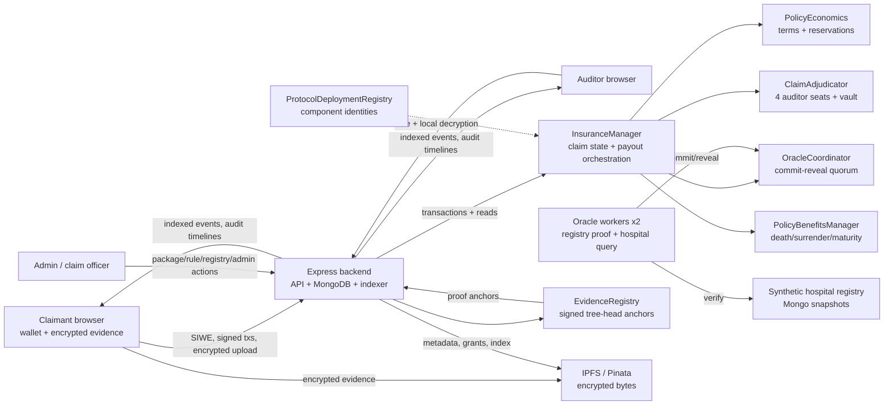

# Block-Insure: Current Project Overview

> **Purpose of this document**
>
> This is the current, standalone description of the Block-Insure thesis prototype. It reconciles the older material in `docs/` and `reference/` with the implementation that is currently in the repository. The source code, deployment scripts, tests, and generated model artifacts are authoritative when an older document disagrees with this overview.

**Repository:** `Block-Insure`  
**Document status:** current system overview  
**Destination:** the repository directory is named `reference/` (singular)  
**Scope:** the whole project, including the original policy/claim workflow and the five later implementation phases

## 1. The project in one paragraph

Block-Insure is a blockchain-backed insurance-claim prototype for health and related insurance scenarios. A policy is purchased and economically reserved on Ethereum-compatible smart contracts. A claimant submits an encrypted claim and evidence from a browser. The backend indexes events, stores encrypted evidence metadata, runs an advisory fraud-risk model, and coordinates external data services. Independent oracle workers reconstruct and verify a synthetic hospital-registry proof, then use a timed commit-reveal protocol to reach an exact-result quorum on-chain. A verified result allocates a deterministic payout automatically; a failed or conflicting result is routed to a four-auditor manual adjudication process. The claimant withdraws a funded payout through a pull-payment flow. Appeals start a new claim version and a new oracle cycle. Every material decision is represented by events, versioned hashes, evidence-tree heads, or auditable backend records.

The project is deliberately hybrid: the blockchain is the shared authority for money, eligibility, state transitions, consensus, and audit anchors; the backend provides indexing, authentication, policy administration, model execution, API ergonomics, and encrypted/off-chain data handling; the browser protects claimant evidence and private cryptographic identity; and oracle workers bridge external records into deterministic on-chain facts.

## 2. Why it exists

Traditional claims processing concentrates trust in one insurer database and one administrative workflow. A claimant normally cannot independently demonstrate which rule was applied, whether a document was changed, whether a hospital record was consulted, or why a payout/rejection occurred. Block-Insure explores whether a hybrid blockchain system can improve:

1. **Integrity:** policy terms, claim versions, reservations, votes, payouts, and registry commitments are tamper-evident.
2. **Confidentiality:** raw medical evidence stays off-chain and is encrypted before upload.
3. **Availability of reasoning:** indexed events, evidence-tree proofs, versioned model/registry identities, and audit exports make the decision history inspectable.
4. **Reduced single-operator trust:** multiple oracle identities and four deterministic auditor seats are used instead of one backend verdict.
5. **Economic safety:** coverage and treasury reservations are checked before a claim can promise a payout.
6. **Research reproducibility:** model data, feature schema, hashes, synthetic profiles, evaluation artifacts, migration manifests, and test commands are retained in the repository.

This is a research and demonstration system, not a production insurer. The hospital registry is synthetic, the administrative publisher is still trusted, and production deployment would require a real key-management/HSM, independent data providers, operational monitoring, privacy review, and legal/compliance controls.

## 3. Main research contribution

The implementation combines several mechanisms that are normally demonstrated separately:

- Solidity state machines for policies, claims, coverage accounting, payouts, appeals, benefits, and manual adjudication.
- A version-bound oracle protocol using commit-reveal, exact-result consensus, snapshot eligibility, and timeout resolution.
- Canonical Merkle leaves and historical registry roots so oracles prove which external record they used.
- Browser-side AES-256-GCM evidence encryption with Recrypt proxy re-encryption for auditor access.
- A calibrated Bernoulli Naive Bayes fraud-risk model with reproducible feature and model identities.
- Evidence-tree inclusion/consistency proofs and signed on-chain tree-head anchors.
- A backend blockchain indexer with confirmation depth and checkpoint/reorg recovery.
- Phase-5 evaluation under connected-component grouping, temporal holdout, distribution shift, provider compromise, and high-fraud stress profiles.

The research question is not “can a blockchain replace an insurer?” It is whether these mechanisms can produce a more accountable, verifiable, and economically constrained claim decision while keeping sensitive evidence off-chain.

## 4. System at a glance



### Trust boundaries and data placement

| Boundary | What is authoritative | What it must not be trusted for |
|---|---|---|
| Smart contracts | Monetary values, policy terms/versions, coverage reservations, claim state, claim version, oracle quorum, auditor votes, payout vault, benefits, registry/evidence anchors | Storing raw medical files or running the ML model |
| Backend/API | Authentication session, API orchestration, indexing, notifications, model calculation, admin UX, encrypted metadata and audit export | Being the final authority for a payout or vote; the backend must reconcile transactions with chain events |
| MongoDB | Operational projections: users, attempts, oracle logs, hospital snapshots, evidence events, indexer checkpoints | Immutable historical truth by itself; the off-chain evidence chain is operator-maintained and is anchored periodically |
| IPFS/Pinata | Encrypted evidence bytes addressed by content hash | Plaintext confidentiality without the claimant's keys or a valid Recrypt grant |
| Browser | Wallet signing, AES encryption/decryption, Recrypt private identity, local proof checks | Secure storage on a compromised device |
| Oracle workers | Independent observations and registry proof reconstruction | Unilateral finalization; they can only commit/reveal and the coordinator decides |
| Admin | Publishing packages, rules, registry roots, model identity, role/configuration actions, and some routing actions | Direct claim approval/rejection/settlement/appeal decision; those are contract-controlled |

## 5. Technology stack

### Blockchain and contracts

- Solidity `0.8.26` in the current contracts package.
- Hardhat `2.28.x`, Ethers `6.16.x`, OpenZeppelin Contracts `5.6.1`, Chai/Mocha tests, and Solidity coverage.
- A local Hardhat network uses chain ID `31337`. The deployment is intentionally non-proxy and has no upgrade key.
- The main deployed components are `InsuranceManager`, `PolicyEconomics`, `OracleCoordinator`, `ClaimAdjudicator`, `EvidenceRegistry`, `PolicyBenefitsManager`, and `ProtocolDeploymentRegistry`.

### Backend and data

- Node.js with Express `5.2.1`, Mongoose `9.6.2`, Ethers `6.x`, Axios, SIWE `3.x`, JWT, Helmet, CORS, Multer, Pinata/IPFS integration, and Recrypt node bindings.
- MongoDB stores operational projections and encrypted-evidence metadata.
- `backEnd/model-params.json` is the current model identity; `backEnd/evaluation-results/` contains frozen evaluation artifacts and charts.

### Frontend

- React `19.2.x`, Vite `8.x`, React Router `7.x`, TanStack React Query `5.x`, Ethers `6.x`, ESLint `10.x`, and Recrypt WASM.
- MetaMask (or an EIP-1193 compatible wallet) signs SIWE messages and contract transactions.

### Oracle and cryptography

- Two Node.js oracle processes use separate wallets, API credentials, registry snapshots, cursor files, and structured logs.
- Keccak-256 is used for Solidity protocol commitments and result digests. Canonical registry leaves and evidence-tree leaves use SHA-256 with domain separation.
- Evidence uses AES-256-GCM and Recrypt proxy re-encryption (`BINSENC2`, `RECRYPT-RS-0.15+A256GCM`).

## 6. Repository map

| Directory/file | Responsibility |
|---|---|
| [`contracts/contracts`](../contracts/contracts) | Solidity contracts and interfaces |
| [`contracts/scripts/deploy-local.js`](../contracts/scripts/deploy-local.js) | Local deployment, configuration, default package/benefit schedule, registry registration |
| [`backEnd`](../backEnd) | Express API, Mongo models, services, indexer, model, evaluation artifacts |
| [`frontend/src`](../frontend/src) | React routes, wallets, claim/evidence UX, dashboards |
| [`oracle`](../oracle) | Oracle polling workers, hospital verification, Merkle reconstruction, commit/reveal |
| [`scripts`](../scripts) | Local launcher, preflight, verification, reproducibility and research utilities |
| [`docs`](../docs) | Current operational/security notes plus historical thesis drafts |
| [`reference`](.) | This overview and historical project/thesis/reference artifacts |
| [`README.md`](../README.md) | Current setup, commands, UI capabilities, and operator quick start |

The old documents in `docs/` and `reference/` are preserved for thesis provenance. They are not all current specifications. In particular, old versions describe an admin-operated approval path, reputation-weighted consensus, optional encryption, older model counts, and older contract-size/test results. Those statements should be read as historical design snapshots unless they agree with the source code and this overview.

## 7. Actors and authorization

### Human roles

- **Claimant/user:** buys a policy, pays recurring premiums, submits claims/appeals, uploads encrypted evidence, and withdraws a finalized settlement.
- **Admin:** publishes policy packages and economic rules, manages roles/configuration, publishes registry snapshots, funds the manager/benefits vaults, routes failed claims, and performs explicitly authorized benefit actions.
- **Claim officer:** may perform the operational claim/oracle routing actions assigned to that role, but cannot bypass the contract's oracle or adjudication rules.
- **Auditor:** receives an assigned manual-review seat, validates evidence locally after a grant, votes once, and can inspect audit/proof views.
- **Oracle:** operates an external observation worker and commits/reveals a signed result. Oracle membership and per-request eligibility are snapshotted.

### Authentication and authorization layers

1. The wallet signs a SIWE message containing domain, URI, chain ID, nonce, and resources.
2. The backend verifies the signature and consumes a cryptographically random nonce.
3. A short-lived JWT contains issuer/audience/JTI. Logout writes the JTI to `RevokedToken`.
4. Middleware checks token revocation and the current database role.
5. For privileged roles (`ADMIN`, `AUDITOR`, `ORACLE`), the backend also verifies the current on-chain role before allowing sensitive operations.
6. The contract remains the final authorization layer for funds, claim transitions, votes, and oracle results.

Rate limits protect login/nonce endpoints, claim submission attempts, and wallet-level claim volume. Uploads are memory-buffered and limited to permitted PDF/JPG/PNG/octet-stream types and 10 MB by default.

## 8. Smart-contract protocol

### 8.1 `InsuranceManager`

`InsuranceManager` is the claim-facing coordinator. It owns the primary claim state machine and calls the extension modules through immutable manager relationships.

**Roles:** `ADMIN_ROLE`, `CLAIM_OFFICER_ROLE`, `ORACLE_ROLE`, `AUDITOR_ROLE`, and `EMERGENCY_ROLE`.

**Policy lifecycle:** an admin creates a package; the holder purchases the exact package price; recurring premiums are due every 30 days with a seven-day grace period. Policies can be `ACTIVE`, `GRACE_PERIOD`, `LAPSED`, `CANCELLED`, `EXPIRED`, or `RENEWED`. Effective status is computed from timestamps and lazily refreshed. A holder can reinstate a lapsed policy or cancel it subject to the contract rules.

**Claim states:**

`SUBMITTED` -> `DUPLICATE_CHECKED` -> `ORACLE_PENDING` -> `ORACLE_VERIFIED` -> `PAYOUT_READY`/`FUNDING_REQUIRED` -> `SETTLED`.

Risk or oracle failures can move through `FRAUD_FLAGGED`, `ORACLE_FAILED`, and `MANUAL_REVIEW` before `REJECTED` or payout. `APPEALED` begins a new versioned cycle. The enum retains `CLOSED` and the event exists for compatibility/future lifecycle work, but the current implementation has no active transition that sets a claim to `CLOSED`. There is no active `APPROVED` enum state: the `ClaimApproved` event is emitted as a compatibility/decision signal while the actual state becomes `PAYOUT_READY` or `FUNDING_REQUIRED`.

**Submission checks:** the policy owner submits a non-future incident with claim type, hospital, invoice/document identifiers, and an evidence CID/hash. The manager rejects malformed inputs and caps the number of claims per policy. `PolicyEconomics` validates coverage, waiting periods, service codes, exclusions, deadlines, required documents, invoice uniqueness, and amount limits before reserving exposure. The manager also applies on-chain duplicate checks and a structural confidence score. This score is not the ML fraud probability; it rewards verifiable structural facts and is capped at 100.

**Oracle result:** only the coordinator can finalize an oracle result. A verified result immediately calls payout allocation. A false, conflicting, or timed-out result records a conservative failure and becomes eligible for manual review after the configured routing delay.

**Settlement:** if the manager has enough free balance, it allocates the insurer liability to the adjudicator vault and marks the claim `PAYOUT_READY`. If not, it records the liability as `FUNDING_REQUIRED`; anyone can activate it after sufficient funding. The claimant withdraws through a pull-payment function, after which the claim becomes `SETTLED` and economics are settled.

**Appeal:** only the claimant can appeal a rejection. The appeal reserves the configured appeal exposure, increments `claimVersion`, clears the previous cycle's resolution/request data, starts a new adjudicator appeal round, and immediately requests a fresh oracle cycle. Results from an older claim version cannot be reused.

### 8.2 `PolicyEconomics`

This module keeps `InsuranceManager` below the EIP-170 contract-size limit and isolates financial policy rules.

- Admins publish strictly increasing, versioned `PackageRules`.
- A purchase snapshots the current package rule version into immutable `PolicyTerms`.
- Rules include service-code allow/exclusion lists, waits, claim deadline, minimum documents, deductible, coinsurance/share, per-claim cap, maximum claim, Merkle roots, formula version, and rule version.
- Claim validation reserves coverage before an accepted claim proceeds.
- Settlement applies deductible, insurer-share basis points, and caps deterministically.
- Exposure, active reservations, unfunded liabilities, a minimum capital buffer, and a reserve ratio protect the treasury.
- Rejection releases the reservation; claimant withdrawal settles it.

The local default package is **Health Basic**: `0.01 ETH` premium, `1 ETH` coverage, 365-day term, and `HOSPITAL_BILL` service code. The local deployment then configures the versioned rules used by the demo.

### 8.3 `OracleCoordinator`

The coordinator replaces loose Boolean-majority behavior with an exact-result, timed commit-reveal protocol.

1. The manager creates a request containing a query hash, claim version, model identity, and current registry snapshot.
2. The coordinator snapshots the active oracle set, quorum threshold, registry version/root, model version, and expected response count.
3. Each eligible oracle commits a hidden result before the commit deadline.
4. Reveal opens after all expected commitments or after the commit deadline. A reveal must match its commitment, request metadata, claim version, registry version/root, model version, result hash, and salt.
5. Matching exact result digests are counted. A result reaches quorum only when the same verdict and bound metadata have the required exact count.
6. If all reveals finish without an exact quorum, the request fails conservatively as a conflict. After the reveal deadline, anyone can resolve a timeout.
7. Oracle revocation does not invalidate an oracle already selected for a request; eligibility is the snapshot, not the current membership list.

The commitment and result formats are mirrored in [`oracle/protocol.js`](../oracle/protocol.js). This prevents an oracle from changing a verdict, registry root, claim version, or model identity between commit and reveal.

The coordinator also stores immutable historical registry snapshots containing root, schema/tree version hash, record count, block, and publication time. Root publication is still admin-controlled, but in-flight requests cannot silently switch datasets.

### 8.4 `ClaimAdjudicator`

This separate module handles claims that cannot be safely auto-verified.

- Exactly four active auditor seats are selected deterministically from `keccak(claimId, claimVersion)`.
- Each assigned auditor may vote once before the review deadline.
- Three valid votes approve and allocate a payout; two invalid votes reject.
- Expiry is permissionlessly finalized as `REVIEW_TIMED_OUT` (a conservative rejection).
- Appeal rounds have separate decision records and cannot reuse old votes.
- Funded and unfunded payout liabilities are held in a vault with non-reentrant pull withdrawals.
- Reputation is derived from unique finalized outcome observations using a smoothed Beta mean: `(successes + 1) * 100 / (successes + failures + 2)`. It is not an arbitrary admin score and is not used as on-chain vote weight.

### 8.5 `EvidenceRegistry`

`EvidenceRegistry` is the on-chain transparency anchor for the off-chain evidence log.

- A wallet registers an encryption public key, signing public key, identity version, and scheme version; identities can be revoked.
- The admin anchors signed append-only evidence tree heads with increasing tree size, root, and previous root.
- The signed digest binds the registry address and chain ID, preventing cross-contract replay.
- Inclusion and consistency proofs can be checked against an anchored head.

### 8.6 `PolicyBenefitsManager`

Benefits are intentionally outside the size-constrained claim manager. It supports versioned `BenefitTerms` for `DEATH`, `SURRENDER`, and `MATURITY`.

- One to three beneficiaries can be registered, with unique addresses and shares totaling 100%.
- Death requires an active policy and evidence; surrender requires cancellation and the configured minimum installments; maturity requires expiry and an enabled schedule.
- Each request is approved/rejected/settled through the connected benefits contract, which reserves complete liabilities and uses pull withdrawals.
- Rejection releases its reservation. Excess withdrawals remain subject to reserve protection.

The local schedule enables death at 100% and surrender at 50%, requires six installments, and leaves maturity disabled; the local deployment funds the benefits vault separately.

### 8.7 Deployment identity and migration

`ProtocolDeploymentRegistry` records component addresses, interface versions, protocol version, and a migration-manifest hash. The protocol has no proxy upgrade path. A migration is explicit: export state, deploy the new component set, reconcile export hashes, and register the new manifest. See [`docs/protocol-v2-migration.json`](../docs/protocol-v2-migration.json) and [`docs/security-verification.md`](../docs/security-verification.md).

## 9. End-to-end user and service flows

### 9.1 Package, purchase, and premium flow

1. Admin publishes or updates a versioned package/rule schedule.
2. Public users can inspect active packages and advisory coverage scenarios.
3. The claimant signs a purchase transaction with the exact premium.
4. The contract snapshots the package rules into the policy terms and starts the coverage interval.
5. The claimant pays recurring premiums; due/grace/lapse behavior is computed from the policy timestamps.

### 9.2 Claim submission flow

1. The browser predicts the next claim identifier and constructs associated data containing claim ID, version, uploader, and evidence type.
2. Evidence is encrypted locally with a random AES-256-GCM key. The encrypted payload and metadata are uploaded to IPFS through the backend.
3. The browser submits the on-chain claim transaction with the CID/hash and deterministic claim facts.
4. The backend records an attempt, reconciles the transaction and indexed event, and attaches evidence metadata.
5. `PolicyEconomics` checks the policy terms and reserves exposure. The manager performs duplicate/uniqueness checks and enters `DUPLICATE_CHECKED` or `FRAUD_FLAGGED`.

The backend never receives the plaintext evidence key. A claimant can later grant an assigned auditor a Recrypt transform key without disclosing the AES key to the backend.

### 9.3 Advisory fraud and registry verification

The backend builds a deterministic feature vector from claim facts and the registry response. Blocking comparison failures prevent automatic verification. Fuzzy-only anomalies or a model probability over the configured threshold recommend manual review. The model is advisory: the contracts never accept a backend probability as final truth.

An oracle independently queries the mock hospital API, loads its own registry snapshot, reconstructs the canonical Merkle leaf, validates the proof/root, checks claim/hospital/invoice/date/bill consistency, and computes the deterministic result hash. Only the coordinator's exact-result quorum changes the contract state.

### 9.4 Automatic result, funding, and withdrawal

- Exact quorum with `verified=true`: the manager records `ORACLE_VERIFIED` and allocates the economics-calculated liability.
- Sufficient balance: the adjudicator vault is funded and the claim becomes `PAYOUT_READY`.
- Insufficient balance: the claim becomes `FUNDING_REQUIRED`; anyone can activate it after the manager is funded.
- The claimant invokes withdrawal; the vault sends funds to the claimant, economics settles the exposure, and the claim becomes `SETTLED`.

There is no direct admin “approve”, “settle”, or “close” button that bypasses this path.

### 9.5 Manual review and appeal

Failed/conflicting/timed-out oracle results or explicit fraud flags can be routed to manual review. Four deterministic auditors receive the case. Evidence is locally decrypted only after an owner grant, and each assigned auditor casts one on-chain vote. The threshold is three valid votes or two invalid votes; deadline expiry rejects.

The claimant can appeal a rejection within the configured limit. The appeal starts a new version and new oracle/adjudication cycle, preserving the old decision while preventing stale results from being reused.

### 9.6 Death, surrender, and maturity benefits

The claimant or authorized beneficiary submits a benefit request with the required evidence. The benefits manager checks policy status, terms, installments, beneficiary shares, and available reserves. Admin confirmation is an operational step for this extension; liability accounting and withdrawals remain contract-controlled.

## 10. Registry, Merkle proofs, and oracle workers

The demonstration hospital registry is deliberately synthetic. A record includes canonical hospital/provider identifiers, license status, patient hash, treatment/diagnosis information, dates, bill/range data, invoice identity, and status fields. The registry service:

1. Normalizes fields into a canonical serialization.
2. Hashes each leaf with SHA-256 and a domain prefix.
3. Sorts leaves deterministically (invoice hash/number ordering).
4. Builds a pairwise SHA-256 Merkle tree and publishes the root, tree/schema version, and leaf count.
5. Keeps separate primary and Oracle-2 snapshots in Mongo for operational source separation.

The two workers run with separate wallets, API keys, snapshot IDs, and event cursors. They poll from their saved chain position, retry safely, verify proofs locally, and then commit/reveal. Operational independence is stronger than one process but is not a cryptographic proof that the underlying source data is independent.

The result hash binds request ID, claim ID, query hash, claim version, registry version/root, model identity, verification verdict/code, and reconstructed leaf hash. Timestamps, wallet identity, and other nondeterministic fields are excluded from consensus so honest workers can produce the same exact result.

## 11. Evidence confidentiality and audit transparency

### Confidentiality pipeline

1. The browser generates a random 32-byte AES key and AES-GCM nonce.
2. It encrypts the evidence bytes with associated data containing the claim/version/uploader/evidence type.
3. It wraps the AES key to the uploader's Recrypt public identity and stores only the ciphertext, capsule, metadata, and receipt hashes off-chain.
4. The owner grants an auditor a transform key bound to the auditor identity and claim.
5. The backend performs the PRE transformation without learning the plaintext or AES key.
6. The auditor browser downloads the encrypted bytes, verifies the receipt hash, associated data, and payload magic, then decrypts locally.

Private identities live in browser IndexedDB. A wallet-signature-derived encrypted backup supports recovery. Production use requires a KMS/HSM or equivalent key custody; a browser device is not a hardened key vault.

### Evidence transparency pipeline

Evidence metadata/events form an append-only hash chain and a Merkle tree in the backend. Signed tree heads commit to the tree size, root, and previous root. The `EvidenceRegistry` anchors those heads on-chain. An auditor can therefore verify inclusion and append-only consistency without putting medical bytes on-chain. The database operator still controls availability of historical full trees, so the anchor proves integrity more strongly than it proves permanent data availability.

## 12. Fraud-risk model and research evaluation

### Current feature and inference pipeline

The current schema is `fraud-features-v3` with 18 binary/advisory features:

`clean_registry_match`, `registry_record_missing`, `hospital_id_mismatch`, `invoice_hash_mismatch`, `claim_exceeds_registry_bill`, `bill_range_anomaly`, `treatment_type_mismatch`, `date_mismatch`, `invalid_record_status`, `used_invoice`, `cancelled_record`, `license_suspended`, `license_blacklisted`, `repeat_claim_pattern`, `provider_velocity_anomaly`, `claimant_velocity_anomaly`, `near_duplicate_advisory`, and `missing_or_noisy_record`.

The classifier is a Bernoulli Naive Bayes model with Laplace smoothing (`alpha=1`) and log-space posterior calculation. A Platt calibration artifact (`platt-v1`) converts the raw score to a probability. Current identity values are stored in [`backEnd/model-params.json`](../backEnd/model-params.json):

- model version: `bernoulli-fraud-v3.0.0`
- feature schema: `fraud-features-v3`
- threshold: `0.5`
- training set: 480 records (49 fraud, 431 legitimate)
- temporal calibration split: latest 20% (120 records)
- source commit, training-data hash, artifact hash, and model identity hash: recorded in the JSON artifact

Risk bands are `LOW` below `0.35`, `MEDIUM` from `0.35` to below `0.70`, and `HIGH` at or above `0.70`. Blocking comparison failures, or a non-fuzzy probability at or above `0.85`, recommend rejection from automatic oracle verification. Fuzzy-only anomalies and probabilities at or above the model threshold (`0.5`) recommend manual review. Otherwise the result is eligible for automatic verification. The recommendation is a workflow signal, not a payout decision.

### Phase-5 evaluation artifact

The current frozen evaluation uses four synthetic profiles (normal, high-fraud stress, provider compromise, and temporal distribution shift), 600 records per profile, five folds, seeds 11/29/47, connected claimant/provider component grouping, and calibration inside the training fold. Aggregate values in [`backEnd/evaluation-results/phase5-evaluation.json`](../backEnd/evaluation-results/phase5-evaluation.json) are:

| Metric | Aggregate |
|---|---:|
| Accuracy | 0.9113 |
| Precision | 0.4481 |
| Recall | 0.2177 |
| F1 | 0.2869 |
| ROC AUC | 0.8875 |
| PR AUC | 0.5774 |
| Brier score | 0.0640 |
| Calibration error | 0.0644 |

The temporal holdout is intentionally harder: train 480/test 120, TP 16, TN 81, FP 5, FN 18, accuracy 0.8083, precision 0.7619, recall 0.4706, F1 0.5818, ROC AUC 0.8028, PR AUC 0.6475, and Brier score 0.1529. The same artifact reports zero fuzzy-duplicate automatic-rejection attacks and zero connected-group leakage detections for the tested scenarios. These are synthetic research results, not real-world accuracy claims.

## 13. Backend services and API surface

The Express backend runs on port `5000` by default, connects to MongoDB, starts a blockchain event listener/indexer, and exposes these route families:

`/api/auth`, `/api/users`, `/api/documents`, `/api/policy-packages`, `/api/policies`, `/api/policy-benefits`, `/api/claims`, `/api/appeals`, `/api/votes`, `/api/evaluation`, `/api/admin`, `/api/audit`, `/api/oracle`, `/api/notifications`, `/api/indexer`, `/mock/hospital`, and `/api/evidence-transparency`.

Important backend responsibilities include:

- SIWE login, JWT/revocation, role and on-chain-role checks.
- Claim submission prechecks, transaction recording, reconciliation, abandonment tracking, and wallet/IP rate limits.
- Encrypted document upload, claim attachment, receipt validation, grant/revoke, and Recrypt transform operations.
- Public package/rule/scenario previews and authenticated policy/eligibility queries.
- Admin package/economic-rule/benefit/registry/reserve/evaluation/role-health actions.
- Oracle result logs, API-key heartbeats, mock-hospital verification, and health dashboards.
- Audit export combining indexed contract events, backend logs, appeals, votes, and evidence anchors.

Mongo models include `User`, `RevokedToken`, `File`, `EvidenceEvent`, `EvidenceTreeHead`, `EvidenceGrant`, `EvidenceAccessLog`, `Appeal`, `ClaimSubmissionAttempt`, `AdminActionLog`, `OracleLog`, `OracleHealth`, `MockHospitalRecord`, `MockHospitalRecordOracle2`, `VotingFinalization`, `Notification`, `IndexedBlock`, `IndexedBlockchainEvent`, and `IndexerCheckpoint`.

### Indexer and notifications

The indexer tracks the manager, coordinator, adjudicator, economics, and evidence registry. It waits for three confirmations by default, processes chunks of roughly 500 blocks, stores checkpoints, and can roll back on a detected reorganization. Notifications are deduplicated by status/transaction and explain the next action for oracle verification, manual review, funding, settlement, and benefits.

## 14. Frontend capabilities

The React application has public login/home views; claimant dashboards for policies, purchase, premiums, claims, appeals, evidence, benefits, and notifications; admin dashboards for packages, economic rules, benefits, registry, reserve/evaluation/health, audit actions, role health, and claims; and auditor views for registry/proofs, claim history, encrypted-document verification, voting, reputation, and notifications.

The claim form encrypts evidence before upload and associates it with the predicted claim ID/version. The detail view follows indexed on-chain state and transaction progress. The auditor document view performs local hash/receipt checks and decrypts only after the owner grant. React Query caches reads while wallet-connected transactions remain explicit user actions.

## 15. Local deployment and operator workflow

The safest clean demo sequence is:

```text
1. Install the repository dependencies and create the required local .env files.
2. Start MongoDB and a Hardhat JSON-RPC node.
3. Run: npm run setup:local
4. Start the backend, frontend, and two oracle workers separately, or run: npm run dev:all
5. Connect a wallet to chain 31337 and use the seeded roles/accounts.
```

`setup:local` resets only the Block-Insure runtime database, deploys a fresh chain, grants local roles, creates the default package, deploys/configures extensions, funds the manager and benefits vault, publishes the primary Merkle registry, synchronizes ABIs/configuration, and verifies a clean state. It is intentionally destructive to local demo data; it should not be run against a valuable database.

The launcher no longer starts an empty chain behind the user's back. It verifies that chain ID `31337` is reachable and that the configured `InsuranceManager` has deployed bytecode, then reuses that deployment. If the node/deployment is absent, it tells the operator to start the node and run `setup:local`.

Useful commands are documented in [`README.md`](../README.md), including `npm run preflight`, `npm run verify:all`, `npm run verify:sync`, `npm run dev:observe`, and the contract/backend/frontend/oracle test commands. Development observability writes redacted JSONL events to `.dev-logs/events.jsonl`.

## 16. Verification and reproducibility

The latest recorded repository verification in this workspace reported:

- 124 Solidity tests in the full verification suite; 123 pass plus one instrumentation-only pending coverage case.
- Contract coverage: approximately 93.64% statements, 64.51% branches, 90% functions, and 94.29% lines.
- Backend analytics suite and 38 backend unit tests pass.
- Frontend ESLint and production build pass.
- Nine oracle protocol tests pass.
- ABI/configuration synchronization and exact reproducibility/frozen model-hash checks pass.
- Contract bytecode sizes after compilation: `InsuranceManager` 24,262/24,576 bytes; `OracleCoordinator` 7,014; `ClaimAdjudicator` 10,818; `PolicyEconomics` 9,484; `EvidenceRegistry` 4,135; `ProtocolDeploymentRegistry` 923; and `PolicyBenefitsManager` 9,981.
- Production dependency audits report no findings for backend, frontend, oracle, or contract production dependencies. The full Hardhat/toolchain development tree still has transitive findings that must be tracked separately.

External Slither, Forge, Echidna, and Solhint are optional tools and were not available in the recorded environment. The Solidity suite includes stateful/invariant coverage and the repository contains a security/migration verification guide.

## 17. Security model and honest limitations

### Protections implemented

- Exact-result commit-reveal prevents a loose Boolean majority and binds every result to claim/registry/model versions.
- Snapshot eligibility prevents mid-request oracle revocation from changing the quorum set.
- Timeouts and conflicts fail conservatively and are permissionless to resolve.
- Coverage and treasury reservations prevent unsupported liabilities from silently becoming withdrawals.
- Pull payments and non-reentrant vault functions reduce payout reentrancy risk.
- Claim versioning prevents old oracle/adjudication outcomes from being replayed after appeal.
- Encrypted evidence, associated-data checks, content receipts, identity revocation, PRE grants, and signed evidence-tree heads separate confidentiality from auditability.
- SIWE nonce consumption, JWT revocation, role synchronization, API keys, rate limits, and confirmation-aware indexing protect the service boundary.

### Limitations that must be stated in a thesis defense

1. **Admin-controlled publishers:** package rules, registry roots, model identity, evidence tree-head anchoring, role assignment, and some benefits actions still depend on an admin. Versioning makes changes traceable; it does not decentralize the publisher.
2. **Operational oracle independence:** two wallets/processes and separate snapshots are not proof of independent real-world hospitals or APIs.
3. **Synthetic ground truth:** model labels and hospital records are generated for research. Results cannot be presented as clinical or production fraud accuracy.
4. **Off-chain availability:** historical Mongo evidence trees and encrypted IPFS objects need operational retention and pinning; an on-chain root alone cannot reconstruct a missing tree/file.
5. **Client key custody:** browser IndexedDB and wallet-derived backups are not a production HSM/KMS.
6. **Contract headroom:** `InsuranceManager` is close to the EIP-170 limit, which is why benefits and economics were split into modules. Future features should not be added casually to the manager.
7. **Deferred lifecycle:** `CLOSED` remains a retained enum/event concept without a current transition. Maturity is a benefits schedule, not an active claim-closure path.
8. **Model trade-off:** the current threshold deliberately favors precision/verification safety over high recall in some synthetic profiles. Manual review is the safety valve.
9. **Development dependencies:** the production dependency audits are clean, but the Hardhat/toolchain transitive audit still needs ongoing maintenance.
10. **Local deployment:** the seeded setup is for a local Hardhat demonstration, not a live network deployment or an insurance-ready operational environment.

## 18. Evolution through the five implementation phases

The project evolved from an admin-operated claim demonstrator into the current modular protocol:

1. **Foundation:** policies, packages, claims, duplicate checks, evidence metadata, a backend/frontend, and the first oracle path.
2. **Policy/economic modularization:** advisory policy rules and a separate `PolicyEconomics` module introduced versioned terms, coverage reservations, and deterministic settlement.
3. **Adjudication:** `ClaimAdjudicator` introduced deterministic four-auditor review, thresholds, appeal rounds, vault withdrawals, and derived reputation.
4. **Evidence and benefits:** encrypted evidence/PRE, transparency anchors, and the separate `PolicyBenefitsManager` added confidentiality/auditability and death/surrender/maturity flows.
5. **Protocol hardening:** `OracleCoordinator` exact commit-reveal, historical registry snapshots, model/registry/claim-version binding, timeout/conflict safety, reproducible model evaluation, migration identity, indexer/reorg handling, and final integration checks.

Some old reference files use different phase labels or combine several milestones. The implementation—not the label in an old file—is the authority for behavior.

## 19. Documentation provenance

This overview was synthesized from the current README, Solidity contracts, deployment scripts, backend/frontend/oracle source, model/evaluation artifacts, and the documentation-bearing files in `docs/` and `reference/`. The following files remain useful for historical context and thesis drafting but should not override this document:

- [`docs/POLICY_RULES_PHASE_1.md`](../docs/POLICY_RULES_PHASE_1.md) and [`docs/POLICY_BENEFITS_PHASE_2.md`](../docs/POLICY_BENEFITS_PHASE_2.md): module design notes.
- [`docs/security-verification.md`](../docs/security-verification.md): verification/migration guidance.
- [`docs/synthetic-external-registry-boundary.md`](../docs/synthetic-external-registry-boundary.md): synthetic registry boundary (its older encryption wording is superseded by the current implementation).
- [`docs/developer-observability.md`](../docs/developer-observability.md): local logs/observability.
- [`docs/methodology-updated.tex`](../docs/methodology-updated.tex) and [`docs/experiments-results-updated.tex`](../docs/experiments-results-updated.tex): thesis-method/results drafts with historical counts.
- `block-insure-project-overview (11july).md`, [`thesis-defense-overview.md`](thesis-defense-overview.md), and [`block-insure-ultimate-methodology-results-reference.md`](block-insure-ultimate-methodology-results-reference.md): earlier architecture and defense narratives.
- [`chapter-3-4-exact-reference.md`](chapter-3-4-exact-reference.md) and the IEEE/template artifacts: earlier thesis structure and publication formatting.

The copied `Innovest` directory and blank academic templates are preserved reference assets, not Block-Insure runtime components.

## 20. Glossary for a supervisor or examiner

- **Claim version:** monotonically increasing cycle number; an appeal creates a new one.
- **Exact-result consensus:** quorum requires the same verdict and the same bound result metadata, not merely the same Boolean.
- **Commit-reveal:** an oracle first commits to a hidden hash, then reveals the result and salt later.
- **Registry snapshot:** immutable on-chain identity of the Merkle root, schema/version, record count, block, and time used by a request.
- **Merkle proof:** compact inclusion evidence that a canonical hospital record belongs to a published root.
- **Policy reservation:** locked coverage/treasury exposure that backs a potential claim liability.
- **Pull payment:** the contract records a payable balance; the recipient withdraws it instead of receiving a push transfer during a complex state transition.
- **Recrypt/PRE:** proxy re-encryption transforms a capsule for an authorized auditor without exposing the underlying plaintext key to the proxy.
- **Evidence tree head:** a signed commitment to an append-only off-chain evidence tree, anchored on-chain.
- **Advisory model:** the fraud model can recommend a workflow, but only contract consensus/adjudication can decide the claim.
- **Operational projection:** a backend/Mongo representation reconstructed from chain events; it is convenient, but the chain remains authoritative for protocol state.

## 21. Supervisor takeaway

The defensible identity of Block-Insure is a **modular, auditable hybrid insurance protocol**. It places money and state transitions on-chain, keeps medical bytes encrypted and off-chain, uses independently operated oracles to bind external registry facts to exact versioned consensus, and provides a conservative human-review fallback. The model, indexer, dashboards, and audit export make the system usable and measurable; the contracts make the final economic path verifiable. The thesis should present the synthetic data, admin trust, client key custody, operational oracle independence, and local-network status as explicit boundaries—not hide them as production guarantees.
