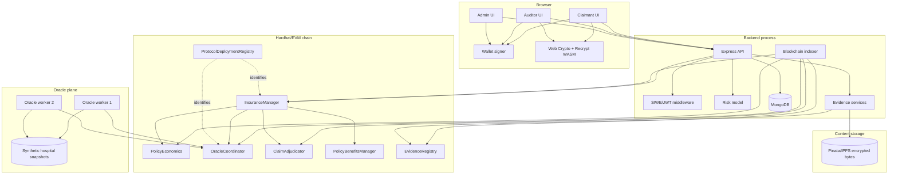
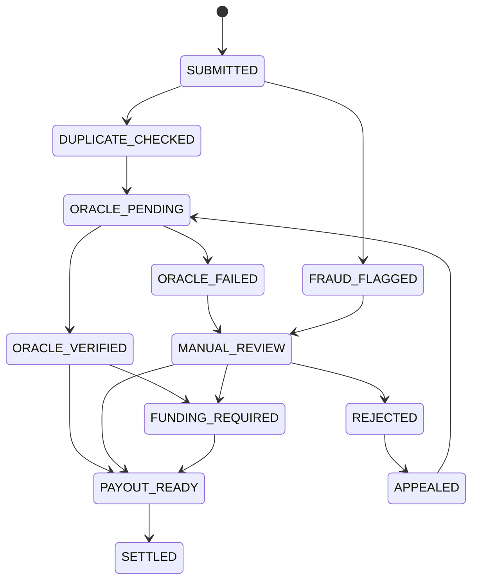
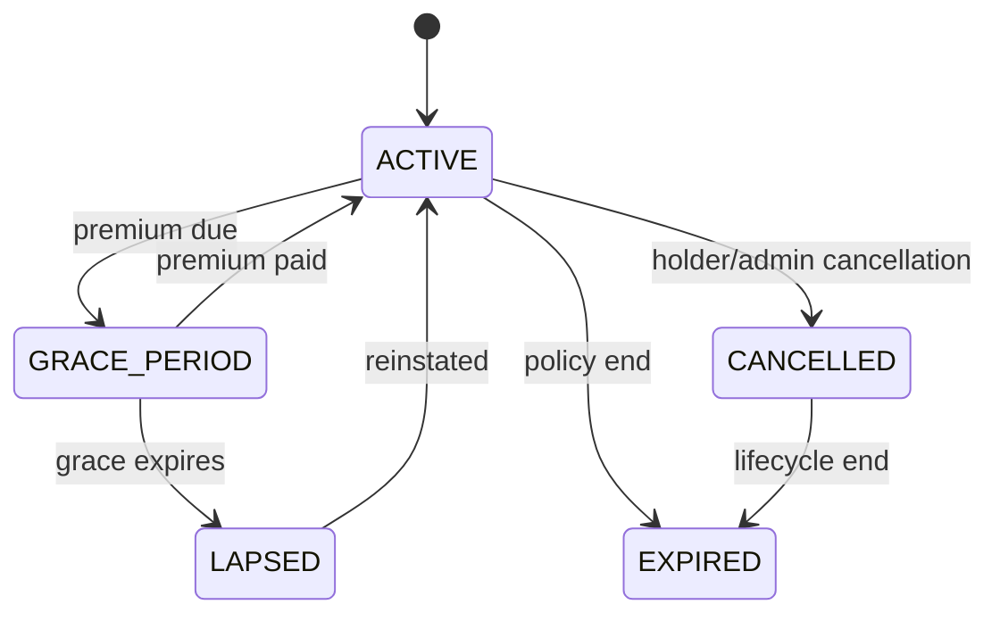
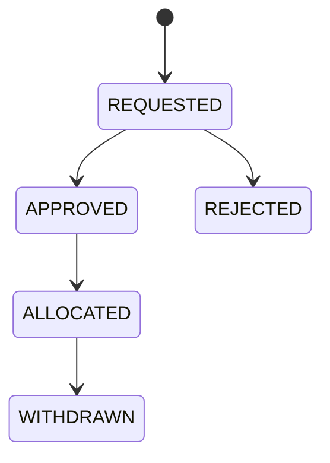
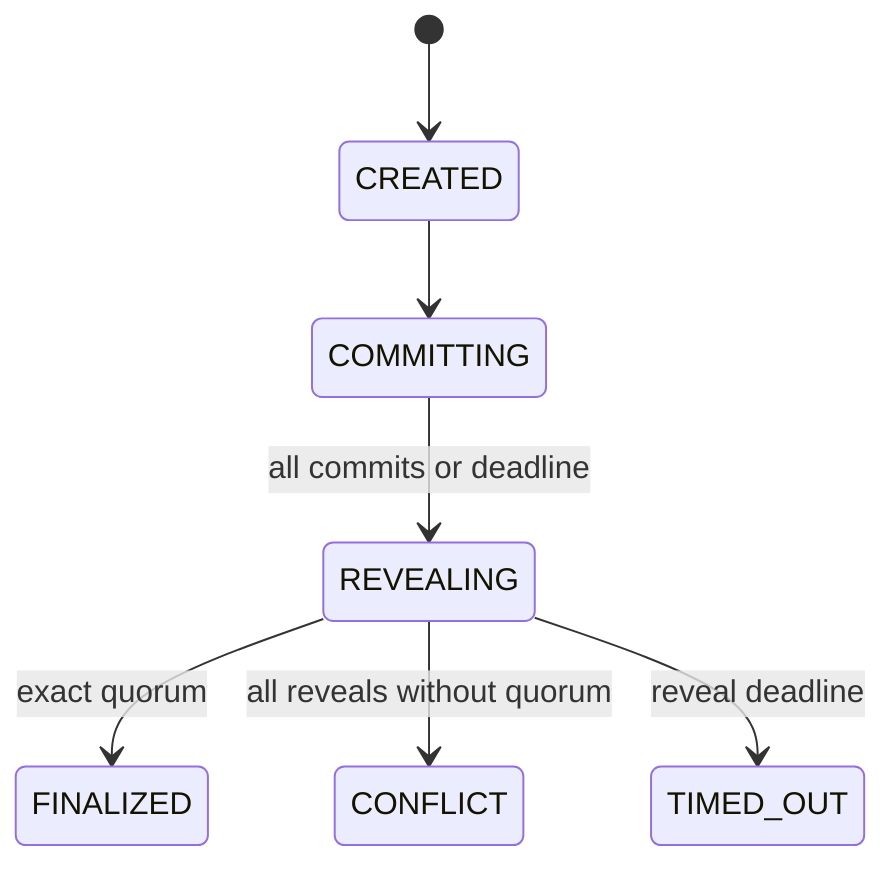

# Block-Insure Deep Technical Reference

> A code-oriented companion to [`block-insure-current-project-overview.md`](block-insure-current-project-overview.md).
>
> This document is intentionally more detailed than the supervisor overview. It explains the implementation boundaries, state machines, data contracts, algorithms, transaction choreography, operational assumptions, and research interpretation of the current repository.

**Repository:** `Block-Insure`  
**Reference directory:** `reference/` (singular)  
**Audience:** thesis supervisor, examiner, implementer, reviewer, and future maintainer  
**Authority rule:** current source code, deployment scripts, tests, and frozen artifacts override older prose

---

## 0. How to read this reference

### 0.1 Three levels of truth

This project contains three kinds of information.

1. **Protocol truth**
   - Solidity storage and transitions.
   - Contract events and emitted transaction receipts.
   - On-chain hashes, balances, roots, and role assignments.

2. **Operational truth**
   - Backend projections and reconciliation records.
   - Oracle logs and health records.
   - Encrypted-file metadata and evidence-tree heads.
   - Notifications and audit exports.

3. **Research truth**
   - Synthetic data-generation assumptions.
   - Model artifacts and evaluation metrics.
   - Gas and throughput experiments.
   - Historical design rationale in thesis drafts.

The backend can make an operational projection stale.

It cannot rewrite a mined contract event.

The model can make an advisory recommendation.

It cannot mint a payout without contract consensus.

An admin can publish a new registry root.

The request stores the root version that it selected.

### 0.2 What “current” means here

This reference describes the implementation after the five major protocol phases.

It does not describe every historical prototype state.

Old documents may still mention:

- Admin approval as the normal claim path.
- Boolean-majority oracle voting.
- Reputation-weighted oracle votes.
- An `APPROVED` claim enum value.
- A `NEEDS_MORE` auditor outcome.
- Optional or plaintext evidence handling.
- Old test counts, model sizes, thresholds, and contract sizes.

Those statements are historical unless the current source confirms them.

### 0.3 Terminology used in this file

| Term | Meaning in the current implementation |
|---|---|
| Manager | The `InsuranceManager` contract, not the backend admin |
| Coordinator | The `OracleCoordinator` contract |
| Economics | The `PolicyEconomics` contract |
| Adjudicator | The `ClaimAdjudicator` contract |
| Benefits module | The `PolicyBenefitsManager` contract |
| Registry | The synthetic hospital-record Merkle registry |
| Evidence registry | The `EvidenceRegistry` contract and its off-chain evidence tree |
| Model | The advisory Bernoulli Naive Bayes pipeline |
| Request | An oracle verification request, identified by a coordinator request ID |
| Claim version | A versioned decision cycle; an appeal increments it |
| Root version | A historical registry snapshot version |
| Model version | The model identity hash/version bound to a request |
| Reservation | Coverage/liability reserved by `PolicyEconomics` |
| Vault | The adjudicator payout balance or benefits balance |

---

## 1. Project identity and research framing

### 1.1 The practical problem

An insurance claim requires several different kinds of trust.

The claimant must prove an event.

The insurer must apply the correct policy terms.

The hospital or external provider must supply a truthful record.

The fraud analyst must interpret anomalies.

The final decision must be funded.

An auditor must be able to explain the decision later.

In a conventional database, these concerns are often joined by a privileged workflow.

The person operating the workflow can become the effective source of truth.

Block-Insure separates the concerns into modules.

It makes the important monetary and state transitions contract-verifiable.

It keeps sensitive medical content off-chain.

It uses external observations without allowing one oracle to settle a claim alone.

It records a conservative manual path when automatic verification is unsafe.

### 1.2 The research proposition

The project tests whether a hybrid architecture can provide:

- Stronger evidence integrity than an unanchored application database.
- More explicit authority than a backend-only approval endpoint.
- Better confidentiality than storing medical documents on-chain.
- More reproducible model results than an undocumented score.
- More predictable economic behavior than ad hoc settlement code.

### 1.3 What the project does not claim

It does not claim that blockchain provides a real hospital record.

It does not claim that synthetic data proves clinical fraud performance.

It does not claim that two oracle processes prove real-world source independence.

It does not claim that browser storage is equivalent to an HSM.

It does not claim that an admin-controlled registry is decentralized governance.

It does not claim that the local Hardhat network is production infrastructure.

### 1.4 One-sentence thesis identity

> Block-Insure is a modular hybrid insurance protocol in which encrypted evidence, advisory risk analytics, Merkle-bound external records, exact multi-oracle consensus, deterministic auditor adjudication, and reserved on-chain settlement combine to produce an auditable claim lifecycle.

---

## 2. Complete architecture

### 2.1 Logical layers

The system is easiest to reason about as six logical layers.

| Layer | Main components | Primary job |
|---|---|---|
| Presentation | React, Vite, wallet provider, React Query | User actions, status displays, local encryption/decryption |
| Service | Express controllers/routes, auth, rate limits | API boundary, orchestration, reconciliation, notifications |
| Operational data | MongoDB models, IPFS/Pinata, evidence tree | Projections, encrypted bytes, logs, proofs |
| Intelligence | Feature engineering, Naive Bayes, calibration, evaluation | Advisory fraud-risk and research measurement |
| External observation | Oracle workers, mock hospital API, Merkle snapshots | Independent registry reconstruction and result generation |
| Protocol | Solidity modules on an EVM chain | Authority, money, quorum, claims, votes, anchors |

### 2.2 Runtime process topology



### 2.3 The direction of authority

The normal direction of an accepted claim is:

```text
Browser evidence
  -> backend encrypted transport
  -> policy/economics validation
  -> manager claim state
  -> oracle observation
  -> coordinator exact consensus
  -> manager payout allocation
  -> adjudicator vault
  -> claimant withdrawal
```

The normal direction of a failed claim is:

```text
Browser evidence
  -> policy/economics validation
  -> fraud/registry anomaly
  -> oracle conflict/false/timeout
  -> manual-review routing
  -> four auditor assignments
  -> quorum or expiry
  -> payout allocation or rejection
```

The backend orchestrates these actions.

The contracts enforce the permitted order.

### 2.4 Data placement matrix

| Data | Browser | Backend/Mongo | IPFS | Chain |
|---|---:|---:|---:|---:|
| Plain medical document | Temporary only | No | No | No |
| Encrypted medical bytes | Optional cache | Metadata only | Yes | No |
| Evidence CID/receipt | Yes | Yes | Address | Hash/CID reference |
| AES key | Encrypted locally | No plaintext | Wrapped capsule only | No |
| Policy terms | Read cache | Projection | No | Yes |
| Claim amount/status | Read cache | Projection | No | Yes |
| Model probability | Display | Yes | No | Model identity only |
| Registry leaf | Proof workspace | Snapshot | No | Root only |
| Oracle commitment | No | Log | No | Yes |
| Oracle reveal | No | Log | No | Yes |
| Auditor vote | Wallet UI | Projection | No | Yes |
| Evidence tree root | Display | Signed head | Optional artifact | Anchor |

### 2.5 Failure containment

If MongoDB is unavailable, the chain remains the economic authority.

If IPFS is unavailable, new evidence upload should fail safely.

If the model is unavailable, automatic verification should not be treated as safe.

If one oracle is unavailable, the request waits until the commit/reveal deadlines.

If all oracles disagree, the coordinator records a conflict.

If the manager cannot fund a liability, the claim becomes `FUNDING_REQUIRED`.

If an auditor does not vote, deadline finalization remains possible.

If the claimant does not withdraw, the vault retains the pull balance.

---

## 3. Repository map and build graph

### 3.1 Top-level directories

| Path | Current role |
|---|---|
| `contracts/` | Hardhat project, Solidity sources, tests, deployment scripts, generated ABI/artifacts |
| `backEnd/` | Node/Express service, controllers, models, services, tests, model/evaluation artifacts |
| `frontend/` | React/Vite client and wallet/evidence UX |
| `oracle/` | Oracle worker runtime and protocol helpers |
| `scripts/` | Cross-project setup, launcher, preflight, verification, reproducibility tooling |
| `docs/` | Operational notes, security/migration notes, methodology drafts |
| `reference/` | Historical thesis material and current standalone references |
| `.dev-logs/` | Local redacted observability output when enabled |

### 3.2 Important root scripts

| Command | Meaning |
|---|---|
| `npm run setup:local` | Destructive local reset plus fresh deployment/configuration |
| `npm run preflight` | Environment/configuration/repository readiness checks |
| `npm run dev:all` | Start/reuse the expected local service topology |
| `npm run dev:observe` | Start development services with redacted event observation |
| `npm run verify:all` | Cross-project verification suite |
| `npm run verify:sync` | ABI, address, bytecode-size, and configuration synchronization checks |
| `npm run deploy:benefits:local` | Deploy the benefits extension without the complete clean reset |

### 3.3 Contract package

The contracts package uses:

- Solidity `0.8.26`.
- Hardhat `2.28.x`.
- Ethers `6.16.x`.
- OpenZeppelin `5.6.1`.
- Mocha/Chai for tests.
- Solidity coverage instrumentation.
- Optional Slither analysis when installed.

### 3.4 Backend package

The backend uses:

- Express `5.2.1`.
- Mongoose `9.6.2`.
- Ethers `6.x`.
- Axios for external HTTP calls.
- SIWE `3.x` for wallet authentication.
- JWT for sessions.
- Helmet and CORS for HTTP hardening.
- Multer for bounded uploads.
- Pinata integration for IPFS.
- Recrypt node bindings for proxy transformation.
- A Bernoulli Naive Bayes implementation and calibrated model artifact.

### 3.5 Frontend package

The frontend uses:

- React `19.2.x`.
- Vite `8.x`.
- React Router `7.x`.
- TanStack React Query `5.x`.
- Ethers `6.x`.
- ESLint `10.x`.
- Browser Web Crypto.
- Recrypt WASM.

### 3.6 Oracle package

The oracle process uses:

- Node.js.
- Ethers.
- Axios.
- Two instance-specific environment files.
- Per-chain/per-coordinator/per-oracle cursor files.
- Structured logs and heartbeat signatures.

---

## 4. Roles, identity, and authorization in detail

### 4.1 Application roles

The backend database role is one of:

- `USER`.
- `ADMIN`.
- `AUDITOR`.
- `ORACLE`.

The chain uses role bytes32 values.

The two role systems are related but not interchangeable.

### 4.2 Wallet authentication sequence

```text
Client requests nonce
  -> backend creates random 16-byte nonce
  -> backend constructs SIWE message
  -> wallet signs message
  -> backend verifies domain, URI, chain ID, nonce, and signature
  -> backend consumes nonce
  -> backend issues JWT with issuer, audience, JTI, and expiry
```

The nonce is single-use.

The signed message includes resources when configured.

The JWT default lifetime is one hour.

The session lifetime is configurable with `SESSION_TTL_MS`.

Logout persists the token JTI in `RevokedToken`.

### 4.3 Privileged request sequence

```text
HTTP request
  -> JWT signature/expiry check
  -> JTI revocation check
  -> user lookup and current database role
  -> on-chain role check for sensitive roles
  -> controller validation
  -> contract transaction or read
```

The backend does not trust a stale role field in a JWT.

The on-chain role check prevents a removed operator from continuing through an old session.

### 4.4 Contract roles

| Role | Typical authority |
|---|---|
| `ADMIN_ROLE` | Configuration, packages, roles, registry, funding, admin operations |
| `CLAIM_OFFICER_ROLE` | Operational claim/oracle/manual routing permitted by manager |
| `ORACLE_ROLE` | Oracle membership/worker identity |
| `AUDITOR_ROLE` | Eligibility for auditor workflows |
| `EMERGENCY_ROLE` | Emergency pause behavior where permitted |

The coordinator maintains an active oracle list.

The adjudicator maintains an active auditor list.

The manager remains the owner of its configured module relationships.

### 4.5 Rate limits and bounded inputs

The backend protects:

- Nonce requests.
- Login attempts.
- Claim submission checks.
- Wallet-level daily claims.
- Oracle API calls.
- Multipart uploads.

The default claim IP limit is five requests per fifteen minutes.

The default nonce limit is thirty requests per fifteen minutes.

The default login limit is fifteen requests per fifteen minutes.

Uploads are limited to ten megabytes by default.

Allowed types include PDF, JPG, PNG, and configured binary/octet-stream evidence.

---

## 5. `InsuranceManager` implementation reference

Source: [`contracts/contracts/InsuranceManager.sol`](../contracts/contracts/InsuranceManager.sol)

### 5.1 Responsibility boundary

`InsuranceManager` is the claim-facing state machine.

It is not the package-rule calculator anymore.

It is not the auditor vault anymore.

It is not the evidence byte store.

It is the authority that connects those modules.

### 5.2 Major storage groups

The manager stores:

- Package definitions.
- Policy records.
- Claim records.
- Claim documents.
- Settlement records.
- Counters for package, policy, and claim identifiers.
- Used document hashes.
- Wallet/date/type duplicate keys.
- Oracle/coordinator address.
- Economics module address.
- Adjudicator address.
- Current model identity.
- Treasury balance through native contract balance.

### 5.3 Claim status enum

The current enum contains:

1. `SUBMITTED`.
2. `DUPLICATE_CHECKED`.
3. `FRAUD_FLAGGED`.
4. `ORACLE_PENDING`.
5. `ORACLE_VERIFIED`.
6. `ORACLE_FAILED`.
7. `MANUAL_REVIEW`.
8. `PAYOUT_READY`.
9. `REJECTED`.
10. `SETTLED`.
11. `CLOSED`.
12. `FUNDING_REQUIRED`.
13. `APPEALED`.

There is no active `APPROVED` enum member.

`ClaimApproved` is an event retained as a compatibility/decision signal.

The payout path immediately chooses `PAYOUT_READY` or `FUNDING_REQUIRED`.

`CLOSED` is retained but is not currently assigned by an active transition.

### 5.4 Policy status enum

The current policy lifecycle includes:

- `ACTIVE`.
- `GRACE_PERIOD`.
- `LAPSED`.
- `CANCELLED`.
- `EXPIRED`.
- `RENEWED`.

The effective status can be derived from timestamps.

The stored status is synchronized lazily by refresh functions and transition operations.

### 5.5 Package creation

The admin creates a package with a premium and coverage definition.

The package also carries policy-level defaults.

The economics module can publish a richer rule schedule for the same package ID.

The package must exist before a policy can be purchased.

Deactivated packages cannot be newly purchased.

Existing policy terms remain the snapshot selected at purchase time.

### 5.6 Policy purchase

The purchaser calls `purchasePolicy` with the exact package premium.

The manager rejects an incorrect `msg.value`.

The policy receives a new numeric ID.

The economics module records a terms snapshot.

The first coverage interval is opened.

The waiting-period end is recorded.

The policy owner becomes the claimant authority for that policy.

### 5.7 Premium timing

The expected recurrence interval is thirty days.

The grace period is seven days.

The policy end date caps the computed due/grace dates.

`payPremium` records a premium payment.

`reinstatePolicy` pays the configured amount to revive a lapsed policy.

`cancelPolicy` is holder/admin constrained by the manager rules.

`deactivateExpiredPolicy` exposes an explicit expired-state operation.

### 5.8 Claim submission preconditions

`submitClaim` requires:

- A valid policy identifier.
- The caller to be the policy owner.
- A policy status that permits a claim.
- A non-future incident timestamp.
- A non-empty claim type.
- A non-empty hospital identifier/name.
- A non-empty invoice/document identity.
- A non-empty evidence hash/CID reference.
- A claim amount within the relevant policy constraints.
- The policy claim count below the per-policy limit.

The manager invokes economics validation/reservation before the claim advances.

### 5.9 Duplicate and structural checks

Duplicate protections include:

- Used document hash checks.
- Wallet/date/claim-type uniqueness.
- Economics-level invoice uniqueness.
- Policy-level maximum claim count.

A duplicate path is marked conservatively.

The manager calculates a structural verification confidence.

The confidence is not the backend fraud probability.

The score rewards facts such as:

- Active policy.
- Incident inside coverage.
- Amount inside coverage.
- Evidence/document presence.
- New document identity.
- Invoice uniqueness.
- Wallet/date/type uniqueness.

The score is capped at 100.

Successful oracle verification adds a bounded increment.

### 5.10 Oracle request gating

`requestOracleVerification` is allowed for the configured operational roles.

The claim must be `DUPLICATE_CHECKED` or `APPEALED`.

The manager creates the canonical query hash.

The query binds:

- Claim ID.
- Policy ID.
- Claimant wallet.
- Claim amount.
- Incident date.
- Claim type.
- Hospital identifier.
- Invoice identity.
- Document/evidence hash.
- Claim version.
- Registry version/root.
- Model version.

The manager moves the claim to `ORACLE_PENDING`.

### 5.11 Oracle finalization

Only the coordinator can call manager finalization.

The manager verifies that the request is associated with the claim.

The coordinator supplies the claim version and bound metadata.

On a verified result:

```text
ORACLE_PENDING
  -> ORACLE_VERIFIED
  -> calculate economics settlement
  -> allocate payout or record funding requirement
```

On a false/conflict/timeout result:

```text
ORACLE_PENDING
  -> ORACLE_FAILED
  -> record rejection reason
  -> set manual-review eligibility after routing delay
```

### 5.12 Manual-review routing

`sendToManualReview` can be called immediately by permitted operational roles.

After the configured eligibility time, the public wrapper can be used.

Only eligible failure/fraud states can be routed.

The manager calls `ClaimAdjudicator.startReview`.

The manager changes the claim to `MANUAL_REVIEW`.

### 5.13 Manual-review finalization

The adjudicator calls manager finalization.

An approved adjudicator result uses the same payout allocation path.

A rejected result calls economics release.

The manager records a decision hash and rejection reason.

The claim becomes `REJECTED` on the rejection path.

### 5.14 Payout allocation

The manager calls economics `calculateSettlement`.

The result contains insurer liability and claimant responsibility.

The manager compares its available balance with the insurer liability.

If sufficient:

```text
manager balance
  -> adjudicator payout allocation
  -> PAYOUT_READY
```

If insufficient:

```text
unfunded liability recorded
  -> FUNDING_REQUIRED
  -> later activateFundedClaim
```

The shortfall is emitted for UI/operations.

### 5.15 Claim funding activation

`activateFundedClaim` is permissionless after funding conditions are satisfied.

It moves the liability into the adjudicator vault.

It changes the claim to `PAYOUT_READY`.

It prevents the admin from silently editing the already calculated amount.

### 5.16 Withdrawal and settlement

The claimant calls `withdrawSettlement`.

The manager invokes adjudicator withdrawal.

The economics module settles the reservation.

The manager records a settlement record.

The claim changes to `SETTLED`.

The pull-payment design avoids a push transfer inside every complex state transition.

### 5.17 Appeal reset semantics

An appeal is claimant-only.

The appeal must target a rejected claim.

Economics reserves the appeal exposure.

The claim version increments.

The prior request reference is cleared.

The prior resolution fields are cleared.

The prior rejection reason is replaced by the new-cycle state.

The confidence score is reset/recomputed for the new cycle.

The adjudicator begins an appeal round.

The manager enters `APPEALED`.

The new oracle request binds the new version.

### 5.18 Manager events

Important events include:

- `PolicyPackageCreated`.
- `PolicyPackageUpdated`.
- `PolicyPackageDeactivated`.
- `PolicyPackageReactivated`.
- `PolicyPurchased`.
- `PolicyStatusChanged`.
- `PremiumPaid`.
- `ClaimSubmitted`.
- `DocumentAdded`.
- `ClaimFlagged`.
- `OracleRequested`.
- `OracleResultSubmitted`.
- `OracleTimedOut`.
- `ClaimApproved`.
- `ClaimRejected`.
- `ClaimAppealed`.
- `ClaimReopenedAfterAppeal`.
- `ClaimAppealFinalized`.
- `ClaimSentToManualReview`.
- `AuditorVoteCast`.
- `AuditorReputationUpdated`.
- `SettlementCalculated`.
- `ClaimSettled`.
- `ClaimClosed`.
- `ClaimDecisionRecorded`.
- `PayoutAllocated`.
- `ClaimFundingRequired`.
- `ClaimFundingActivated`.
- `SettlementWithdrawn`.
- `ManualReviewEligibilitySet`.
- `ClaimAdjudicatorConfigured`.
- `ContractFunded`.
- `ExcessWithdrawn`.
- `AuditorOutcomeObserved`.

### 5.19 Manager invariants

The following are intended invariants.

1. A nonexistent policy cannot be claimed.
2. A non-owner cannot submit a policy claim.
3. A claim cannot be oracle-requested twice in the same cycle.
4. An old claim version cannot finalize a new appeal.
5. Only the coordinator can submit a final oracle result.
6. Only the adjudicator can finalize manual review.
7. A payout cannot exceed the economics-calculated insurer liability.
8. A settled claim cannot be withdrawn again.
9. Excess manager withdrawal cannot violate the protected reserve.
10. A disabled package cannot be purchased.
11. A claim cannot be created after the policy terms forbid it.
12. A funding-required claim cannot activate before the manager has enough value.

---

## 6. `PolicyEconomics` implementation reference

Source: [`contracts/contracts/PolicyEconomics.sol`](../contracts/contracts/PolicyEconomics.sol)

### 6.1 Why this is a separate module

The manager is close to the EIP-170 bytecode limit.

Policy rule evaluation and accounting are high-value logic.

Moving them out reduces manager size.

It also makes the economic rule surface independently testable.

The module stores the manager address immutably.

### 6.2 Package rules

`PackageRules` may include:

- Rule version.
- Policy rule version hash.
- Allowed service codes.
- Excluded service codes.
- Waiting period.
- Claim deadline.
- Minimum document count.
- Deductible basis points.
- Deductible cap.
- Insurer-share basis points.
- Per-claim cap.
- Maximum claim amount.
- Formula/rule identity.
- Merkle root or registry bindings.

Versions must increase strictly.

An update creates an auditable schedule.

It does not mutate the terms already snapshotted into an existing policy.

### 6.3 Policy terms snapshot

At purchase, the economics module records:

- Package ID.
- Rule version.
- Formula version.
- Coverage amount.
- Policy start/end.
- Claim deadline.
- Waiting period.
- Deductible/share configuration.
- Per-claim cap.
- Maximum claim.
- Service-code constraints.
- Exclusion constraints.

This prevents silent in-flight rule substitution.

### 6.4 Coverage intervals

A policy has one or more coverage intervals.

An interval records:

- Start timestamp.
- End timestamp.
- Waiting-period end.
- Closed/exposure state.

`remainingCoverage` reflects unused coverage after reservations.

An interval can close when the policy ends or exposure is explicitly closed.

### 6.5 Claim validation order

The economics validation conceptually performs:

```text
load policy terms
check caller/manager authority
check claim amount and maximum
check incident date and claim deadline
check active coverage interval
check waiting period
check required document count
check service-code allow list
check service-code exclusion list
check invoice uniqueness
check remaining coverage
calculate insurer liability
reserve exposure
```

The manager then performs its own duplicate and structural checks.

The two layers intentionally protect different invariants.

### 6.6 Settlement formula

The formula is deterministic.

Let:

```text
claimAmount = submitted amount
deductible = min(claimAmount * deductibleBps / 10,000, deductibleCap, claimAmount)
afterDeductible = claimAmount - deductible
insurerPays = afterDeductible * insurerShareBps / 10,000
claimantResponsibility = claimAmount - insurerPays
```

The actual Solidity implementation uses integer arithmetic.

Rounding behavior is therefore part of the protocol.

The research document should report the basis points and caps, not only a percentage label.

### 6.7 Reservation lifecycle

```text
no reservation
  -> validateAndReserveClaim
  -> active claim reservation
  -> releaseClaim on rejection
  -> settleClaim on withdrawal
```

An appeal creates a new reservation cycle.

The reservation is the economic backing for a possible liability.

### 6.8 Solvency configuration

The module tracks:

- Active exposure.
- Approved unfunded liabilities.
- Reserve ratio in basis points.
- Minimum capital buffer.
- Treasury funding references.

The protected balance conceptually includes:

```text
required balance
  = unfunded liability
  + minimum capital buffer
  + active exposure * reserve ratio / 10,000
```

`minimumTreasuryBalance` exposes this calculation.

Funding emits an auditable reference hash.

An underfunded claim does not disappear.

It remains a visible liability until funded or otherwise resolved.

### 6.9 Economics events

Important events include:

- `PackageRulesPublished`.
- `PolicyTermsSnapshotted`.
- `CoverageIntervalOpened`.
- `CoverageIntervalClosed`.
- `CoverageReserved`.
- `CoverageReleased`.
- `CoverageSettled`.
- `SolvencyConfigUpdated`.
- `SolvencyWarning`.
- `TreasuryFundingAttributed`.

---

## 7. `OracleCoordinator` exact-consensus reference

Source: [`contracts/contracts/OracleCoordinator.sol`](../contracts/contracts/OracleCoordinator.sol)  
Protocol mirror: [`oracle/protocol.js`](../oracle/protocol.js)

### 7.1 Coordinator responsibility

The coordinator is the protocol boundary between observations and claim state.

Oracles do not call the manager directly.

The backend does not finalize oracle results.

The coordinator validates commitment/reveal correctness.

It counts exact result digests.

It calls the manager only after finalization.

### 7.2 Request snapshot fields

An `OracleRequest` contains or is associated with:

- Request ID.
- Claim ID.
- Query hash.
- Claim version.
- Registry snapshot version.
- Registry root.
- Model version.
- Requested block/deadline data.
- Commit deadline.
- Reveal deadline.
- Expected oracle response count.
- Quorum threshold.
- Finalized flag.
- Outcome/result data.

The exact struct layout is defined by the Solidity source.

### 7.3 Registry snapshot fields

Each historical registry snapshot records:

- Snapshot version.
- Root hash.
- Tree/schema version hash.
- Publication timestamp.
- Publication block.
- Leaf count.

Snapshots are append-only by version.

Requests store the selected snapshot identity.

### 7.4 Consensus defaults

The local coordinator defaults include:

- Quorum threshold: two.
- Commit window: twenty-five blocks.
- Reveal window: twenty-five blocks.

Deployment/configuration can update the consensus settings subject to manager authorization.

The thesis should report configured values and not assume the defaults are immutable.

### 7.5 Request creation

The manager calls `createRequest`.

The coordinator checks:

1. The caller is the manager.
2. A current registry snapshot exists.
3. Enough active oracles exist for quorum.
4. The claim is not already pending in the same cycle.
5. The model and claim metadata are well formed.

The coordinator snapshots active oracle membership.

It also snapshots the quorum and expected response count.

### 7.6 Eligibility snapshot

The request stores an eligibility mapping.

An oracle active at creation is eligible for that request.

An oracle revoked after creation remains eligible for that request.

An oracle added after creation is not silently inserted.

This prevents the admin from changing the vote set mid-cycle.

### 7.7 Commitment construction

The commitment binds:

```text
requestId
claimVersion
registryVersion
verified verdict
resultHash
modelVersion
salt
```

The worker hashes the ABI-encoded values.

The salt prevents a third party from learning the answer before reveal.

The commitment is stored against the oracle address.

Duplicate commitments are rejected.

Late commitments are rejected.

Ineligible commitments are rejected.

### 7.8 Reveal construction

The reveal supplies:

- Request ID.
- Claim version.
- Registry version.
- Registry root.
- Model version.
- Verified Boolean.
- Result hash.
- Salt.

The coordinator recomputes the commitment.

It rejects an incorrect salt.

It rejects changed metadata.

It rejects a wrong root.

It rejects a wrong model version.

It rejects a wrong claim version.

It rejects duplicate reveals.

It rejects reveals after the reveal deadline.

### 7.9 Reveal start condition

Reveal can start when:

- Every expected oracle has committed, or
- The commit deadline has passed.

This avoids waiting for an unavailable oracle forever.

The reveal deadline is derived from the configured window.

### 7.10 Exact result digest

The exact result digest binds the same semantic result across workers.

Conceptually:

```text
exactDigest = keccak256(
  verdict,
  resultHash,
  claimVersion,
  registryVersion,
  registryRoot,
  modelVersion
)
```

The exact encoding is defined by the coordinator and `oracle/protocol.js`.

Two workers that disagree on any bound field do not share an exact digest.

### 7.11 Finalization outcomes

There are three important outcomes.

| Outcome | Condition | Manager result |
|---|---|---|
| Exact quorum | Same exact digest reaches threshold | Verified or false result according to the digest |
| Conflict | All relevant reveals complete but no exact digest reaches threshold | Conservative oracle failure |
| Timeout | Reveal deadline passes before finalization | Conservative oracle failure |

The coordinator calls the manager once.

The finalized flag prevents replay.

### 7.12 Permissionless timeout

`resolveTimedOutRequest` can be called by anyone after the reveal deadline.

Permissionless resolution prevents a stuck request from requiring an admin transaction.

The timeout is still a failure outcome.

It does not create a payout.

### 7.13 Coordinator events

Important events include:

- `OracleRequested`.
- `OracleCommitmentSubmitted`.
- `OracleResultRevealed`.
- `OracleRequestFinalized`.
- `OracleRegistrationUpdated`.
- `ConsensusConfigUpdated`.
- `RegistrySnapshotPublished`.

### 7.14 Coordinator invariants

1. An ineligible oracle cannot commit.
2. An ineligible oracle cannot reveal.
3. A commitment can be submitted once per request/oracle.
4. A reveal must hash to the stored commitment.
5. A reveal must match request metadata.
6. A request finalizes at most once.
7. A request cannot be finalized before a valid quorum/conflict/timeout condition.
8. A request cannot switch registry roots after creation.
9. A revoked selected oracle remains eligible for the selected request.
10. An old claim version cannot finalize a new appeal request.

### 7.15 Worker pseudocode

```text
poll coordinator events
load request
if request already finalized: stop
if this oracle is not eligible: stop
load local registry snapshot named by request
query hospital verification endpoint
reconstruct canonical leaf
verify Merkle path against request root
compare claim facts with record facts
compute verified verdict and result code
compute deterministic result hash
derive deterministic salt from oracle secret/request context
submit commitment before commit deadline
wait for reveal start
submit matching reveal before reveal deadline
record backend log and heartbeat
```

The worker does not trust a leaf hash returned by the hospital API.

It reconstructs the canonical leaf itself.

---

## 8. `ClaimAdjudicator` manual-review reference

Source: [`contracts/contracts/ClaimAdjudicator.sol`](../contracts/contracts/ClaimAdjudicator.sol)

### 8.1 Responsibility boundary

The adjudicator owns auditor assignment, votes, finalization, decision records, and payout vault operations.

The manager owns the claim's top-level status.

The adjudicator informs the manager of the final outcome.

### 8.2 Review record

A manual review includes:

- Claim ID.
- Claim version.
- Four assigned auditor addresses.
- Vote values.
- Approval/rejection counts.
- Review start/deadline.
- Finalized flag.
- Approved flag.
- Decision/reason hash.

### 8.3 Auditor assignment

The assignment seed is derived from:

```text
keccak256(claimId, claimVersion)
```

The active auditor list is sampled deterministically.

The same claim/version therefore produces the same assignment for the same active list.

An auditor can verify whether they are assigned with `isAssigned`.

### 8.4 Vote values

The current vote constants are:

- `VOTE_VALID = 1`.
- `VOTE_INVALID = 2`.

There is no current `NEEDS_MORE` enum path.

One assigned auditor can vote once.

The vote must arrive before the deadline.

### 8.5 Quorum thresholds

The review finalizes when:

- Three valid votes are recorded, or
- Two invalid votes are recorded, or
- The deadline expires.

Expiry becomes a conservative rejection.

This asymmetric threshold allows a decision before all four seats respond.

### 8.6 Manual review pseudocode

```text
manager routes eligible claim
adjudicator selects four auditors
adjudicator records review deadline
auditor checks assignment
auditor decrypts evidence locally if granted
auditor casts VOTE_VALID or VOTE_INVALID
if validCount >= 3: approve
else if invalidCount >= 2: reject
else if now >= deadline: reject timeout
else remain open
```

### 8.7 Decision records

The adjudicator records decisions by claim ID and claim version.

Appeals receive a new round.

The decision record can include:

- Approval flag.
- Decision hash.
- Reason hash.
- Finalizer.
- Finalization timestamp.
- Appeal round.

This creates a historical record rather than overwriting the old decision.

### 8.8 Reputation observations

The contract records unique successful/failed outcome observations.

The smoothed Beta mean is:

```text
reputation = (successes + 1) * 100
             / (successes + failures + 2)
```

The prior contributes one success and one failure.

This avoids an undefined zero-observation score.

The admin does not assign arbitrary numeric reputation.

The score is descriptive.

It is not an on-chain vote-weight multiplier.

### 8.9 Payout vault

The adjudicator records:

- Claimant.
- Claim ID.
- Allocated amount.
- Funded amount.
- Withdrawn amount.
- Funding state.

The payout uses pull withdrawal.

The withdrawal is non-reentrant.

The recipient cannot withdraw a second time.

### 8.10 Adjudicator events

Important events include:

- `AuditorRegistrationUpdated`.
- `ReviewConfigUpdated`.
- `ManualReviewOpened`.
- `AuditorVoteCast`.
- `ManualReviewFinalized`.
- `PayoutRecorded`.
- `PayoutFunded`.
- `PayoutWithdrawn`.
- `DecisionRecorded`.
- `AppealStarted`.
- `AuditorReputationObserved`.

### 8.11 Adjudicator invariants

1. Only the manager starts a review.
2. Only assigned active auditors vote.
3. Each auditor votes once per claim/version.
4. A vote after the deadline is rejected.
5. A review finalizes once.
6. A finalized review cannot accept new votes.
7. A payout cannot be withdrawn beyond its allocation.
8. A rejected review does not leave an unaccounted reserved payout.
9. An appeal creates a separate decision key.

---

## 9. `EvidenceRegistry` and evidence transparency

Source: [`contracts/contracts/EvidenceRegistry.sol`](../contracts/contracts/EvidenceRegistry.sol)

### 9.1 Identity record

An encryption identity contains:

- Encryption public key.
- Signing public key.
- Identity version.
- Scheme version.
- Registration timestamp.
- Revocation status/time where applicable.

The identity belongs to a wallet account.

### 9.2 Identity lifecycle

```text
no identity
  -> registerEncryptionIdentity
  -> active identity
  -> revokeEncryptionIdentity
  -> revoked identity
```

An owner must register before receiving an evidence grant.

An auditor identity is resolved on-chain before transformation.

### 9.3 Evidence event chain

The backend creates a genesis evidence event.

Each new event contains a previous event hash.

The canonical event payload is hashed with a domain prefix.

The event index is monotonic within the operational chain.

The database stores the event document.

The operator can build a Merkle tree over these leaves.

### 9.4 Tree-head anchoring

An evidence tree head contains:

- Tree size.
- Root hash.
- Previous root hash.
- Signature.
- Signer.
- Anchor transaction metadata.

The on-chain digest binds:

- Registry address.
- Chain ID.
- Tree size.
- Root hash.
- Previous root hash.

Tree sizes must increase.

The previous root creates an append-only sequence.

### 9.5 Inclusion proof

An inclusion proof contains:

- Leaf hash.
- Sibling hashes.
- Left/right orientation.
- Tree size/root identity.

Verification recomputes the root.

The verifier compares the recomputed root to the anchored head.

### 9.6 Consistency proof

A consistency proof checks that the later tree extends the earlier tree.

It does not require the verifier to download every old event.

The proof is meaningful only if both heads are authenticated.

### 9.7 Confidentiality does not come from the anchor

The evidence root proves event inclusion/integrity.

It does not reveal medical content.

It does not make ciphertext recoverable if IPFS retention fails.

It does not replace key management.

### 9.8 Evidence security boundary

The backend may transform an Recrypt capsule.

It should not receive the plaintext AES key.

The browser validates associated data before decrypting.

The browser validates the ciphertext receipt before decrypting.

The browser validates the payload magic/version before parsing bytes.

---

## 10. Evidence cryptography format

### 10.1 File encryption inputs

The browser generates:

- A random 32-byte AES key.
- A random AES-GCM IV/nonce.
- Associated data JSON.
- Plain file bytes.

### 10.2 Associated data

Associated data binds the encrypted file to:

- Claim ID.
- Claim version.
- Uploader wallet/identity.
- Evidence type.

Changing associated data causes AES-GCM authentication failure.

This prevents moving ciphertext between claims without detection.

### 10.3 Payload envelope

The encrypted payload has a format identified by:

- Magic prefix `BINSENC2`.
- Version/format fields.
- IV/nonce.
- Ciphertext and authentication tag.

The exact byte layout is implemented by the frontend evidence utility.

The backend treats it as opaque bytes.

### 10.4 Recrypt capsule

The AES key is wrapped to the uploader's encryption identity.

The owner derives a transform key for the auditor's identity.

The backend receives the transform operation.

The backend returns the transformed capsule.

The auditor unwraps the AES key locally.

The backend never needs to decrypt the evidence.

### 10.5 Recovery backup

The private identity is stored in browser IndexedDB.

A wallet-signature-derived encrypted backup can restore it.

The backup is still protected by the wallet/device boundary.

Loss of both wallet and backup can make evidence inaccessible.

Production deployment should use managed key custody.

### 10.6 Evidence grant lifecycle

```text
owner identity registered
  -> auditor selected for manual review
  -> owner grants transform key
  -> backend validates grant and identities
  -> backend performs PRE transformation
  -> auditor downloads ciphertext
  -> auditor decrypts locally
  -> owner may revoke future access
```

The grant does not rewrite the original ciphertext.

It authorizes a new way to unwrap the existing AES key.

### 10.7 Evidence access audit

The backend records:

- Grant creation.
- Grant revocation.
- Transformation request.
- Transformation result metadata.
- Download/access metadata.
- Verification outcome.

The evidence tree can anchor these events.

---

## 11. Synthetic registry and Merkle implementation

### 11.1 Why a synthetic registry exists

The project needs an external record source to test:

- Oracle observation.
- Record lookup.
- Merkle inclusion.
- Data mismatch detection.
- Source disagreement.
- Registry version binding.

Real hospital integration would require consent, security agreements, legal controls, and production APIs.

The mock registry isolates the protocol mechanics.

### 11.2 Canonical record fields

The current canonical leaf includes fields such as:

- Hospital ID.
- Hospital name.
- License ID/status.
- Patient hash.
- Treatment code/type.
- Diagnosis/code.
- Incident/admission/discharge dates.
- Invoice number/hash.
- Bill amount.
- Minimum/maximum bill range.
- Record status.
- Cancellation/suspension/blacklist flags.

The exact field normalization is implemented in the registry service.

### 11.3 Canonicalization requirements

Canonicalization must specify:

- Field ordering.
- Empty-value representation.
- Numeric formatting.
- Timestamp formatting.
- Case normalization.
- Unicode handling.
- Boolean encoding.
- Array/list ordering.

Without canonicalization, two honest workers can hash different bytes.

### 11.4 Leaf hashing

The leaf hash uses SHA-256.

A domain prefix distinguishes a leaf from an internal node.

The leaf payload is canonical serialized data.

The service returns the leaf hash and proof to an oracle.

The oracle reconstructs the leaf independently.

It does not blindly accept the returned leaf hash.

### 11.5 Tree construction

Leaves are sorted deterministically.

The current ordering uses invoice hash/number identity.

Sibling pairs are hashed recursively.

Odd-node behavior is defined by the registry service.

The root is published with a tree/schema version hash.

The leaf count is published.

### 11.6 Proof verification

The oracle verifies:

1. The proof's leaf index/identity.
2. The reconstructed canonical leaf.
3. Every sibling hash and orientation.
4. The final root.
5. The request's selected root version.

A failure becomes a non-verified result.

### 11.7 Historical roots

The coordinator stores roots instead of only the latest root.

An old request can be verified against the root it selected.

An admin cannot silently replace the dataset for an in-flight request.

The backend still needs to retain historical record trees.

Without old leaves/proofs, a later auditor may see the root but not reconstruct the proof.

### 11.8 Source independence boundary

Oracle 1 and Oracle 2 use:

- Separate wallets.
- Separate API credentials.
- Separate snapshot collections.
- Separate cursor files.
- Separate process instances.

They may still depend on the same synthetic generator/operator.

The design therefore demonstrates operational separation, not independent truth.

---

## 12. Oracle worker runtime

### 12.1 Instance configuration

The workers are distinguished by:

- `ORACLE_INSTANCE_ID=1` or the second instance value.
- Private key.
- API key.
- Registry snapshot name.
- Cursor directory.
- Backend heartbeat endpoint.

The second worker uses a separate environment file, commonly `.env.oracle2`.

### 12.2 Event polling

The worker polls coordinator events from a configured start block.

It stores progress in a cursor.

The cursor is scoped to chain/coordinator/oracle.

A retry does not create a second commitment if the chain already contains one.

Finalized requests are skipped.

### 12.3 Worker verification stages

The worker should log each stage:

- Request loaded.
- Snapshot selected.
- Hospital query started.
- Hospital record received.
- Canonical leaf reconstructed.
- Proof verified.
- Claim facts compared.
- Result code selected.
- Result hash generated.
- Commitment submitted.
- Reveal submitted.

The backend log includes model identity and oracle response metadata.

### 12.4 Result categories

The worker can produce a verified or non-verified result.

The non-verified path is intentionally broad.

It includes:

- Record missing.
- Proof invalid.
- Root mismatch.
- Hospital mismatch.
- Invoice mismatch.
- Patient/claim mismatch.
- Date mismatch.
- Amount anomaly.
- Invalid record status.
- Suspended or blacklisted provider.

The exact result code is part of the canonical result hash.

### 12.5 Deterministic result hashing

The result hash binds:

- Request ID.
- Claim ID.
- Query hash.
- Claim version.
- Registry version.
- Registry root.
- Model version.
- Verified flag.
- Result/code hash.
- Reconstructed leaf hash.

Nondeterministic timestamps are not included.

Wallet identity is not included in the semantic result.

The oracle address is still the signer of the transaction.

### 12.6 Heartbeats

The worker sends an authenticated heartbeat.

The backend records health state.

An admin health view can show:

- Last seen time.
- Instance ID.
- Chain/coordinator identity.
- Cursor position.
- Error/retry state.
- Current request activity.

### 12.7 Oracle safety properties

The worker does not:

- Call manager finalization directly.
- Change a request's registry version.
- Reveal with a changed salt.
- Reuse a previous claim version.
- Trust a provider-returned leaf without reconstruction.
- Submit a result after the reveal deadline.

---

## 13. Fraud-risk model: feature engineering

Source areas: [`backEnd/services/featureEngineeringService.js`](../backEnd/services/featureEngineeringService.js), risk scoring, model artifacts

### 13.1 Model identity

The current model identity includes:

- Model version `bernoulli-fraud-v3.0.0`.
- Feature schema `fraud-features-v3`.
- Source Git commit.
- Training-data hash.
- Artifact hash.
- Model identity hash.
- Calibration artifact identity.
- Threshold.

The values are retained in [`backEnd/model-params.json`](../backEnd/model-params.json).

### 13.2 Feature vector

The 18 current features are:

1. `clean_registry_match`
2. `registry_record_missing`
3. `hospital_id_mismatch`
4. `invoice_hash_mismatch`
5. `claim_exceeds_registry_bill`
6. `bill_range_anomaly`
7. `treatment_type_mismatch`
8. `date_mismatch`
9. `invalid_record_status`
10. `used_invoice`
11. `cancelled_record`
12. `license_suspended`
13. `license_blacklisted`
14. `repeat_claim_pattern`
15. `provider_velocity_anomaly`
16. `claimant_velocity_anomaly`
17. `near_duplicate_advisory`
18. `missing_or_noisy_record`

### 13.3 Feature semantics

`clean_registry_match` represents a complete matching record.

`registry_record_missing` indicates no usable external record.

`hospital_id_mismatch` indicates provider identity disagreement.

`invoice_hash_mismatch` indicates invoice identity disagreement.

`claim_exceeds_registry_bill` compares the submitted amount with the record.

`bill_range_anomaly` checks configured range expectations.

`treatment_type_mismatch` compares the service description/code.

`date_mismatch` compares incident and record dates.

`invalid_record_status` captures invalid provider-record status.

`used_invoice` captures an invoice previously bound to a claim.

`cancelled_record` captures a cancelled record.

`license_suspended` captures provider suspension.

`license_blacklisted` captures provider blacklisting.

`repeat_claim_pattern` captures claimant repetition.

`provider_velocity_anomaly` captures high provider activity.

`claimant_velocity_anomaly` captures high claimant activity.

`near_duplicate_advisory` captures fuzzy similarity without making it a hard duplicate.

`missing_or_noisy_record` captures degraded source quality.

### 13.4 Hard versus soft signals

Some comparisons are blocking.

Some are fuzzy/advisory.

A near-duplicate advisory must not become a hard rejection by itself.

The distinction is important for attack evaluation.

It also prevents minor formatting differences from becoming irreversible denial.

### 13.5 Bernoulli Naive Bayes

Each feature is treated as present or absent.

For class `c` and feature vector `x`, the log score is conceptually:

```text
log P(c | x) ∝ log P(c)
  + Σ [x_i * log P(x_i=1|c)
      + (1-x_i) * log P(x_i=0|c)]
```

Laplace smoothing uses alpha one.

Log-space arithmetic reduces underflow.

The model returns a fraud probability.

### 13.6 Calibration

The raw posterior is passed through a Platt calibration artifact.

The current calibration identity is `platt-v1`.

The calibration was trained on the latest twenty percent temporal validation split.

Current recorded parameters include slope approximately `0.5386002105` and intercept approximately `-0.5857824076`.

The probability is still a synthetic-data estimate.

It is not a legal fraud finding.

### 13.7 Risk bands

Current cutoffs are:

- `LOW`: probability below `0.35`.
- `MEDIUM`: probability from `0.35` to below `0.70`.
- `HIGH`: probability at or above `0.70`.

These labels are presentation/workflow bands.

They do not change contract authority.

### 13.8 Recommendation logic

The current recommendation is conceptually:

```text
if blocking comparison failure:
    REJECT_ORACLE_VERIFICATION
else if not fuzzyOnly and probability >= 0.85:
    REJECT_ORACLE_VERIFICATION
else if fuzzyOnly or probability >= 0.50:
    MANUAL_REVIEW_RECOMMENDED
else:
    AUTO_VERIFY_RECOMMENDED
```

The exact implementation should be treated as authoritative if thresholds change.

### 13.9 Model limitations

Naive Bayes assumes conditional feature independence.

The data is synthetic.

The positive class is smaller than the legitimate class.

Provider/claimant correlations can cause leakage.

Temporal shift can reduce calibration.

The model is intentionally used as an advisory gate.

Manual adjudication is the conservative fallback.

---

## 14. Model training and evaluation methodology

### 14.1 Current training artifact

The current recorded training set contains:

- 480 records.
- 49 fraud examples.
- 431 legitimate examples.
- 18-feature schema.
- Laplace alpha one.
- Temporal latest-twenty-percent calibration.

### 14.2 Phase-5 synthetic profiles

The evaluation includes:

1. Normal operation.
2. High-fraud stress.
3. Provider compromise.
4. Temporal distribution shift.

Each profile contains 600 generated records.

### 14.3 Cross-validation design

The evaluation uses five folds.

Seeds include 11, 29, and 47.

Connected claimant/provider components are grouped.

This reduces train/test leakage through repeated actors.

Calibration is fitted inside the training fold.

The latest temporal slice is held out separately.

### 14.4 Aggregate metrics

The current phase-5 artifact reports:

| Metric | Value |
|---|---:|
| Accuracy | 0.9113333 |
| Precision | 0.4480933 |
| Recall | 0.2176933 |
| F1 | 0.2869467 |
| ROC AUC | 0.8874595 |
| PR AUC | 0.5774285 |
| Brier score | 0.0639749 |
| Calibration error | 0.0644135 |

### 14.5 Temporal holdout metrics

The current temporal holdout reports:

- Training size: 480.
- Test size: 120.
- True positives: 16.
- True negatives: 81.
- False positives: 5.
- False negatives: 18.
- Accuracy: 0.8083.
- Precision: 0.7619.
- Recall: 0.4706.
- F1: 0.5818.
- ROC AUC: 0.80284.
- PR AUC: 0.647515.
- Brier score: 0.1529.
- Calibration error: 0.0982.

### 14.6 Attack checks

The frozen evaluation reports:

- Zero fuzzy-duplicate automatic-rejection attacks.
- Zero connected-group leakage detections.

These results are bounded to the tested synthetic generation assumptions.

They do not prove immunity to a real adversary.

### 14.7 Evidence proof experiment

The recorded proof experiment uses tree size 512.

The reported build time is approximately 5.14 ms.

The inclusion proof has nine nodes.

The inclusion payload is approximately 288 bytes.

The consistency proof uses one/32-style recorded proof metadata.

Verification is recorded as true.

### 14.8 Metrics interpretation

ROC AUC measures ranking quality across thresholds.

PR AUC is informative under class imbalance.

Precision matters when false fraud flags are costly.

Recall matters when missed fraud is costly.

Brier score evaluates probability quality.

Calibration error measures probability reliability.

The system intentionally routes uncertain cases to manual review.

---

## 15. Backend API and service reference

### 15.1 Process startup

The backend:

1. Loads environment configuration.
2. Connects to MongoDB.
3. Initializes contract providers/wallets.
4. Starts the Express application.
5. Starts event indexing/listening.
6. Serves API routes.

The process should fail closed when required contract addresses or credentials are absent.

### 15.2 Route families

| Prefix | Responsibility |
|---|---|
| `/api/auth` | Nonces, SIWE login/logout, session state |
| `/api/users` | Profile/identity and user-facing data |
| `/api/documents` | Encrypted file metadata, grants, receipts, transformations |
| `/api/policy-packages` | Public/admin package views and changes |
| `/api/policies` | Purchase/coverage/premium/policy queries |
| `/api/policy-benefits` | Benefit terms, beneficiaries, requests, admin confirmations |
| `/api/claims` | Claim prechecks, submission, reconciliation, detail/status |
| `/api/appeals` | Appeal metadata and history |
| `/api/votes` | Auditor vote/read operations |
| `/api/evaluation` | Model/evaluation summaries |
| `/api/admin` | Role/configuration/routing/funding/operations |
| `/api/audit` | Timeline and audit export |
| `/api/oracle` | Logs, heartbeat, health, authenticated oracle operations |
| `/api/notifications` | User notifications |
| `/api/indexer` | Indexed block/event visibility |
| `/mock/hospital` | Synthetic registry lookup and verification |
| `/api/evidence-transparency` | Tree heads and inclusion/consistency proofs |

### 15.3 Claim controller responsibilities

The claim controller handles:

- Request validation.
- Wallet/policy ownership checks.
- Submission attempts.
- Transaction hash recording.
- Transaction receipt reconciliation.
- Abandoned submission state.
- Claim status projection.
- Model/risk preview.
- Oracle/manual routing requests.

The controller does not finalize the contract decision itself.

### 15.4 Document controller responsibilities

The document controller handles:

- Encryption identity registration lookup.
- Recipient identity lookup.
- Encrypted upload.
- Claim attachment.
- Receipt/hash verification.
- Decryption-key transformation.
- Grant creation/revocation.
- Access logging.

Plaintext evidence is not an expected backend payload.

### 15.5 Policy controller responsibilities

The policy controller handles:

- Active package listing.
- Rule catalog/scenario previews.
- Historical rule preview.
- Risk/pricing quote display.
- User policy listing.
- Eligibility queries.
- Premium and reinstatement transaction preparation.

On-chain terms remain authoritative.

### 15.6 Admin controller responsibilities

Admin services include:

- Package lifecycle.
- Economic rule publication.
- Oracle request creation.
- Timeout resolution.
- Manual-review routing.
- Benefits term confirmation.
- Registry publishing.
- Reserve/settlement intelligence.
- Evaluation summaries.
- Role synchronization.
- Action audit logging.

Admin APIs must not be described as direct claim approval when they only initiate protocol actions.

### 15.7 Oracle controller responsibilities

Oracle endpoints include:

- Structured result logs.
- Heartbeat ingestion.
- Health display.
- API-key verification.
- Mock-hospital verification.

The endpoint cannot bypass coordinator commitment/reveal.

### 15.8 Notification service

Notifications are deduplicated by status and transaction identity.

Typical messages explain:

- Claim received.
- Evidence attached.
- Oracle verification pending.
- Oracle verified and payout allocated.
- Oracle failed and manual review available.
- Funding required.
- Review vote pending.
- Appeal cycle started.
- Settlement withdrawn.
- Benefit approved/rejected/settled.

### 15.9 Core Mongo models

| Model | Function |
|---|---|
| `User` | Wallet, role, profile, identity metadata |
| `RevokedToken` | JWT JTI logout/revocation |
| `File` | Encrypted evidence metadata and CID/receipt |
| `EvidenceEvent` | Append-only evidence event projection |
| `EvidenceTreeHead` | Signed tree-head metadata |
| `EvidenceGrant` | Owner-to-recipient transformation authorization |
| `EvidenceAccessLog` | Evidence access/transformation history |
| `Appeal` | Appeal workflow metadata |
| `ClaimSubmissionAttempt` | Precheck/transaction/reconciliation attempt |
| `AdminActionLog` | Administrative action audit |
| `OracleLog` | Oracle request/result/commit/reveal metadata |
| `OracleHealth` | Heartbeat and liveness projection |
| `MockHospitalRecord` | Primary synthetic registry source |
| `MockHospitalRecordOracle2` | Oracle-2 synthetic snapshot |
| `VotingFinalization` | Manual review finalization projection |
| `Notification` | Deduplicated user messages |
| `IndexedBlock` | Confirmation-aware block record |
| `IndexedBlockchainEvent` | Normalized chain event |
| `IndexerCheckpoint` | Resume/reorg state |

---

## 16. Indexer and reorganization behavior

### 16.1 Why an indexer exists

Smart-contract reads are authoritative but not convenient for dashboards.

The indexer creates queryable projections.

It allows timelines to combine multiple contracts and backend events.

### 16.2 Indexed contracts

The indexer tracks:

- `InsuranceManager`.
- `OracleCoordinator`.
- `ClaimAdjudicator`.
- `PolicyEconomics`.
- `EvidenceRegistry`.

The benefits/deployment modules are included where configured in the deployment manifest.

### 16.3 Confirmation policy

The default confirmation depth is three blocks.

Events below the safe head are projected.

Recent blocks remain provisional.

This reduces display of events from a short-lived reorganization.

### 16.4 Chunking

The default event scan chunk is approximately 500 blocks.

Chunking avoids provider range limits.

The service records the last scanned block.

### 16.5 Reorganization recovery

The checkpoint contains the last trusted block/hash.

If the parent hash disagrees:

1. Find a common ancestor within the configured rollback window.
2. Delete/rebuild affected indexed events.
3. Restore the checkpoint.
4. Rescan forward.

The chain remains authoritative.

The Mongo projection is repairable.

### 16.6 Audit timeline assembly

An audit export may combine:

- Package/policy events.
- Premium/coverage events.
- Claim submission/document events.
- Oracle request/commit/reveal/finalization.
- Registry snapshot publication.
- Manual-review opening/votes/finalization.
- Appeal start/new version.
- Funding/payout/withdrawal.
- Evidence-tree anchor.
- Backend admin/oracle/action logs.

The timeline should distinguish chain timestamps from backend receipt time.

---

## 17. Frontend implementation reference

### 17.1 Route groups

Public routes include:

- Home.
- Wallet login.

Claimant routes include:

- Dashboard.
- Policy list.
- Policy purchase.
- Claim list.
- New claim.
- Claim detail.
- Benefits.
- Notifications.

Admin routes include:

- Admin dashboard.
- Package creation/management.
- Benefits management.
- Healthcare registry.
- Thesis/evaluation dashboard.
- Audit actions.
- Role health.
- Claim list/detail.
- Notifications.

Auditor routes include:

- Auditor dashboard.
- Registry/proof view.
- Claim lookup/history.
- Vote list.
- Vote detail.
- Reputation.
- Document verification.

### 17.2 Wallet behavior

The wallet supplies:

- EIP-1193 provider.
- Account address.
- Chain ID.
- SIWE signature.
- Contract transaction signatures.

The UI expects local chain ID `31337` for the demo.

### 17.3 Claim form choreography

```text
choose policy and claim facts
  -> generate predicted claim ID/version metadata
  -> encrypt evidence in browser
  -> upload ciphertext/metadata
  -> submit on-chain claim
  -> attach/reconcile backend metadata
  -> refresh indexed status
```

The form must handle a wallet rejection separately from an upload failure.

### 17.4 Appeal choreography

The appeal page:

- Displays the rejected claim.
- Collects an appeal reason hash/reference.
- Optionally encrypts new evidence.
- Calls the appeal contract function.
- Attaches evidence metadata after the transaction.
- Refreshes the new claim version.

### 17.5 Auditor workflow

The auditor:

1. Connects a wallet.
2. Loads assigned review.
3. Verifies assignment.
4. Requests/transforms evidence access after owner grant.
5. Checks receipt/associated data locally.
6. Decrypts evidence locally.
7. Reviews registry/audit information.
8. Casts one vote.

### 17.6 Admin workflow

The admin dashboard surfaces:

- Package/rule versions.
- Registry root/version/leaf count.
- Oracle health.
- Claim routing eligibility.
- Review/funding state.
- Reserve and settlement intelligence.
- Benefits term/request state.
- Action audit records.

The UI should describe actions in protocol terms.

---

## 18. Deployment and configuration reference

### 18.1 Local setup sequence

```text
start MongoDB
start Hardhat JSON-RPC on chain 31337
run npm run setup:local
verify generated addresses and ABIs
start backend
start frontend
start oracle 1
start oracle 2
connect wallet
```

### 18.2 What `setup:local` does

The setup script:

1. Resets the Block-Insure runtime database.
2. Funds local operator accounts.
3. Deploys `InsuranceManager`.
4. Uses manager-created `OracleCoordinator`.
5. Uses manager-created `PolicyEconomics`.
6. Sets model identity from `backEnd/model-params.json`.
7. Deploys/configures `ClaimAdjudicator`.
8. Deploys `EvidenceRegistry`.
9. Creates the Health Basic package.
10. Deploys `PolicyBenefitsManager`.
11. Publishes the default benefit schedule.
12. Funds the benefits module.
13. Deploys `ProtocolDeploymentRegistry`.
14. Commits the migration manifest hash.
15. Registers component addresses/interface versions.
16. Grants local roles.
17. Funds the manager reserve.
18. Publishes the primary Merkle registry.
19. Synchronizes ABI/configuration files.
20. Runs clean-state verification.

### 18.3 Destructive boundary

`setup:local` is destructive to local demo data.

It should not be used against a valuable Mongo database.

It should not be used against a shared test chain without confirmation.

The launcher does not silently reset the chain.

### 18.4 Deployment manifest

The protocol deployment registry records:

- Protocol version.
- Component ID.
- Component address.
- Interface version.
- Deployment block/time metadata.
- Migration manifest hash.

The manifest is a reproducibility identity.

It is not a proxy upgrade authority.

### 18.5 Environment groups

Backend configuration normally includes:

- RPC URL.
- Chain ID.
- Contract addresses.
- Backend signing key where required.
- Mongo URL.
- JWT secret/configuration.
- SIWE domain/URI.
- Pinata credentials.
- Recrypt/proxy configuration.
- Oracle API keys.
- Rate limits.

Frontend configuration includes:

- API base URL.
- Chain ID.
- Contract addresses.
- Public wallet/network settings.

Oracle configuration includes:

- Instance identity.
- Private key.
- Backend URL/API key.
- Coordinator address.
- Registry snapshot identity.
- Polling/cursor settings.

### 18.6 Secrets policy

Secrets belong in ignored environment files or a production secret manager.

The repository should retain `.env.example` templates.

No private key should be committed.

No Pinata secret should be committed.

No Recrypt private identity should be committed.

No production JWT secret should be committed.

### 18.7 Launcher invariant

Before starting application services, the launcher verifies:

- RPC availability.
- Chain ID `31337`.
- Configured manager address.
- Deployed bytecode at that address.

If the check fails, the operator must start the chain and run setup.

This prevents a backend from connecting to an empty chain.

---

## 19. Transaction choreography and reconciliation

### 19.1 Why transaction reconciliation exists

A wallet can submit a transaction while the browser loses connectivity.

The backend may receive a hash without a confirmed receipt.

The indexer may see the chain event later.

The application therefore records attempts separately from final state.

### 19.2 Claim submission attempt lifecycle

```text
precheck started
  -> wallet transaction hash recorded
  -> receipt pending
  -> receipt confirmed
  -> chain event indexed
  -> evidence metadata attached
  -> attempt reconciled
```

Failure paths include:

- Validation rejected.
- Wallet rejected.
- Transaction reverted.
- Receipt timeout.
- Event not yet indexed.
- Attachment mismatch.

### 19.3 Idempotency principles

Retrying a read should be safe.

Retrying reconciliation should not create a second claim.

Retrying oracle polling should not create a second commitment.

Retrying notification creation should deduplicate by event/status/transaction.

Retrying evidence attachment should verify the claim/CID association.

### 19.4 Backend versus chain timestamps

The chain timestamp represents protocol block time.

The backend timestamp represents service observation time.

Audit exports should display both when available.

They should not be used interchangeably in consensus hashes.

---

## 20. State-machine reference

### 20.1 Claim state graph



The graph omits internal validation reverts.

It omits the retained but currently unused `CLOSED` transition.

### 20.2 Policy state graph



The exact stored status synchronization is timestamp-aware.

### 20.3 Benefit state graph



The benefits manager has its own request/status enum.

It is separate from claim status.

### 20.4 Oracle request graph



Conflict and timeout are failure outcomes sent to the manager.

---

## 21. Formal-style invariants for a thesis appendix

### 21.1 Version binding

For every finalized oracle result:

```text
result.claimVersion == claim.claimVersion
result.registryVersion == request.registryVersion
result.registryRoot == request.registryRoot
result.modelVersion == request.modelVersion
```

If any equality fails, the reveal is rejected.

### 21.2 Exact quorum

Let `D` be the multiset of exact result digests.

Finalization by quorum requires:

```text
max_count(D) >= quorumThreshold
```

The count is for one exact digest.

Two `verified=true` results with different roots do not share a digest.

### 21.3 Coverage conservation

For a policy interval:

```text
remainingCoverage
  = initialCoverage
  - activeReservations
  - settledClaimExposure
```

The implementation applies integer arithmetic and reservation state.

### 21.4 Payout conservation

For a claim:

```text
allocated
  = withdrawn
  + remainingPullBalance
```

`withdrawn` cannot exceed `allocated`.

### 21.5 One vote

For an auditor `a` and claim version `v`:

```text
votes(claimId, v, a) ∈ {not cast, valid, invalid}
```

There is no fourth vote state.

### 21.6 One finalization

For a request ID:

```text
finalized(requestId) changes false -> true at most once
```

For a review key:

```text
finalized(claimId, version) changes false -> true at most once
```

### 21.7 Evidence authenticity

A valid evidence download requires:

```text
hash(downloadedCiphertext) == storedReceipt
associatedData == expectedClaimBinding
payloadMagic == BINSENC2
AES-GCM authentication succeeds
```

### 21.8 Migration identity

The deployment registry should satisfy:

```text
keccak256(migrationManifestBytes) == committedManifestHash
```

The manifest identifies the component set.

---

## 22. Threat model

### 22.1 Threat actors

The design considers:

- A dishonest claimant.
- A dishonest provider record.
- A compromised single oracle.
- A colluding subset below quorum.
- A stale/replayed claim submission.
- A backend operator altering a projection.
- An auditor who votes outside their assignment.
- A user attempting evidence substitution.
- A wallet/session attacker.
- A treasury operator attempting excess withdrawal.
- A service outage or chain reorganization.

### 22.2 Dishonest claimant

The claimant may submit false facts.

Policy terms and duplicate checks reduce obvious replay.

Registry mismatches become features/results.

Oracle exact consensus prevents one false worker from deciding.

Auditor review handles ambiguous cases.

The system cannot prove that every real-world event happened.

### 22.3 Dishonest single oracle

One oracle can submit a false commitment/reveal.

It cannot finalize alone when quorum is two or higher.

It can cause conflict if it disagrees with an honest oracle.

Conflict fails conservatively and routes to review.

The protection depends on an honest quorum.

### 22.4 Colluding oracle quorum

If enough eligible oracles collude, exact consensus can still be false.

The protocol protects consistency and auditability.

It does not create truth from dishonest source data.

Operational source independence is therefore a primary limitation.

### 22.5 Backend tampering

A backend operator may alter a Mongo projection.

Chain events allow the projection to be rebuilt.

Evidence tree heads expose anchored history changes.

Raw medical bytes remain ciphertext.

The backend can still affect availability and UI presentation.

### 22.6 Evidence substitution

Associated data binds ciphertext to claim/version/uploader/type.

Receipt hashes bind the uploaded bytes.

AES-GCM authenticates the ciphertext.

An altered file should fail verification/decryption.

### 22.7 Auditor impersonation

Auditor actions require wallet signatures.

The contract checks assignment.

The backend checks the current on-chain role.

The evidence grant targets the auditor identity.

### 22.8 Replay after appeal

The claim version increments.

The query hash includes the version.

The coordinator reveal includes the version.

Old results therefore fail the new-cycle binding checks.

### 22.9 Treasury abuse

The economics module calculates protected reserve requirements.

The manager protects excess withdrawal.

The payout vault uses explicit allocation and withdrawal.

The protocol still trusts the configured admin with treasury funding/operations within those bounds.

### 22.10 Reorganization

The indexer waits for confirmations.

The checkpoint stores block/hash state.

The indexer can roll back projections.

The chain's canonical history remains the source of truth.

---

## 23. Security controls checklist

### 23.1 Solidity controls

- Role checks.
- Manager-only extension calls.
- Non-reentrant withdrawals.
- Pause/unpause where configured.
- Exact state preconditions.
- Deadline checks.
- Claim-version checks.
- Registry/model/root binding.
- Protected excess withdrawals.
- Immutable module links where appropriate.

### 23.2 Backend controls

- SIWE nonce consumption.
- JWT issuer/audience/JTI checks.
- Token revocation.
- Current database role check.
- Current on-chain role check.
- Helmet/CORS.
- Rate limits.
- Upload type/size bounds.
- API keys for oracle endpoints.
- Transaction receipt reconciliation.
- Confirmation-aware indexing.

### 23.3 Frontend controls

- Local encryption before upload.
- AES associated-data binding.
- Receipt verification.
- Recrypt identity use.
- Wallet signing.
- Chain ID checks.
- Local proof/decryption verification.

### 23.4 Operational controls

- Separate oracle wallets.
- Separate oracle snapshots.
- Cursor persistence.
- Heartbeats.
- Redacted event logs.
- Action audit logs.
- Deployment manifest.
- ABI synchronization checks.

---

## 24. Test and verification map

### 24.1 Contract tests

Contract tests cover:

- Package and policy lifecycle.
- Premium/grace/lapse behavior.
- Claim validation.
- Duplicate detection.
- Economics reservation/release/settlement.
- Coordinator commit/reveal.
- Exact-result conflicts.
- Timeout resolution.
- Claim-version replay protection.
- Auditor assignment/vote/finalization.
- Payout funding/withdrawal.
- Appeals.
- Evidence identities/tree heads.
- Benefits terms/beneficiaries/requests.
- Deployment registry.

### 24.2 Stateful/invariant tests

Stateful tests exercise sequences rather than isolated calls.

They are important for:

- Reservation conservation.
- State transition order.
- Repeated withdrawal attempts.
- Deadline transitions.
- Appeal cycles.

### 24.3 Backend tests

Backend tests cover:

- Analytics metrics.
- Feature schema.
- Risk recommendations.
- Model artifact identity.
- Claim submission integrity.
- Evidence access/grants.
- Indexer behavior.
- Policy/benefit service behavior.

### 24.4 Oracle tests

Oracle protocol tests cover:

- Result hash determinism.
- Commitment determinism.
- Salt mismatch rejection logic.
- Version/root/model binding.
- Exact digest behavior.
- Canonical registry proof flow.

### 24.5 Frontend checks

Frontend verification includes:

- ESLint.
- Production build.
- ABI/configuration synchronization.

### 24.6 Recorded suite results

The latest recorded cross-project run reported:

- 124 Solidity tests in the full verification suite.
- 123 passing coverage tests plus one instrumentation-only pending case.
- 38 backend unit tests plus the analytics suite.
- Nine oracle protocol tests.
- Passing frontend lint/build.
- Passing synchronization/reproducibility checks.

### 24.7 Coverage

Recorded coverage is approximately:

- Statements: 93.64%.
- Branches: 64.51%.
- Functions: 90%.
- Lines: 94.29%.

Branch coverage is lower than statement coverage.

That difference should be acknowledged in a thesis.

### 24.8 Dependency audits

Production dependency audits for backend/frontend/oracle/contracts reported zero findings in the recorded run.

The full development Hardhat/toolchain tree still reported transitive findings.

Those findings are not silently eliminated with a force upgrade.

They require toolchain maintenance and compatibility review.

### 24.9 Optional analyzers

Slither, Forge, Echidna, and Solhint are not assumed to be installed.

Their absence does not mean the contracts are formally proven.

Their use should be recorded when available.

---

## 25. Gas, size, and performance reference

### 25.1 Contract size

Recorded deployed bytecode sizes are:

| Contract | Bytes | EIP-170 limit |
|---|---:|---:|
| `InsuranceManager` | 24,262 | 24,576 |
| `OracleCoordinator` | 7,014 | 24,576 |
| `ClaimAdjudicator` | 10,818 | 24,576 |
| `PolicyEconomics` | 9,484 | 24,576 |
| `EvidenceRegistry` | 4,135 | 24,576 |
| `ProtocolDeploymentRegistry` | 923 | 24,576 |
| `PolicyBenefitsManager` | 9,981 | 24,576 |

The manager has approximately 314 bytes of headroom.

This is a design constraint.

### 25.2 Why module boundaries matter

Benefits logic was separated because it is not claim-manager core logic.

Economics logic was separated because settlement/accounting is independently testable.

Adjudication was separated because vote/vault state has its own lifecycle.

Evidence anchoring was separated because it has identity/tree-head state.

Deployment identity was separated because migration metadata is not claim state.

### 25.3 Hash-versus-root experiment

`GasTestContract` compares:

- Storing many individual hashes.
- Storing one Merkle root.

The experiment demonstrates an on-chain storage trade-off.

It does not claim that a root eliminates all off-chain retention requirements.

### 25.4 Throughput interpretation

Claim throughput depends on:

- Block gas limit.
- Contract call path.
- Evidence upload latency.
- Mongo/indexer latency.
- Oracle polling interval.
- Commit/reveal windows.
- Backend confirmation depth.

An application-level requests-per-second result is not the same as chain finality throughput.

---

## 26. Operational runbook

### 26.1 Clean local reset

Use only for disposable local data.

```text
stop application processes
ensure Mongo target is the local Block-Insure database
start Hardhat node
run npm run setup:local
check generated environment/address files
start backend/frontend/oracles
```

### 26.2 Existing deployment start

```text
start the already-deployed Hardhat node
verify chain 31337
verify manager bytecode at configured address
run npm run dev:all
```

The launcher should reuse the deployment.

### 26.3 If the launcher reports an empty chain

The likely causes are:

- Hardhat node is not running.
- Chain ID is wrong.
- Environment points to a new node.
- Address files are stale.
- `setup:local` has not been run on this chain.

The safe action is to start the intended node and run local setup when reset is acceptable.

### 26.4 If an oracle is stuck

Check:

- Worker process is running.
- Private key is correct.
- Worker instance ID is unique.
- Coordinator address matches.
- Cursor file is writable.
- API key is accepted.
- Registry snapshot version exists.
- Request is still within commit/reveal windows.
- Worker has the required on-chain role.

After the reveal deadline, anyone can resolve timeout.

### 26.5 If a claim is `FUNDING_REQUIRED`

Check:

- Manager native balance.
- Calculated insurer liability.
- Minimum protected reserve.
- Unfunded liability.
- Benefits vault balance separately.

Fund the manager through the authorized funding flow.

Then call `activateFundedClaim`.

### 26.6 If evidence cannot decrypt

Check:

- Claim ID/version associated data.
- Ciphertext receipt hash.
- `BINSENC2` payload prefix.
- Owner identity registration.
- Auditor identity registration.
- Grant status and recipient wallet.
- Recrypt transform response.
- Browser IndexedDB private identity.

Do not send the plaintext AES key to a support operator.

### 26.7 If the UI is stale

Check:

- Indexer checkpoint.
- Confirmation depth.
- Backend process logs.
- Contract address environment.
- Chain/network selected in wallet.
- React Query cache/refetch state.

Read the contract directly before treating a projection as final.

### 26.8 If the registry proof fails

Check:

- Root version selected by request.
- Snapshot collection used by the oracle.
- Canonical field normalization.
- Leaf ordering.
- Invoice identity.
- Proof sibling order.
- Published root and leaf count.

Do not substitute the latest root for the request's historical root.

---

## 27. Common misconceptions to avoid

### 27.1 “The backend approves claims”

The backend requests/routs operations.

The contracts finalize oracle and auditor outcomes.

Benefits have an administrative confirmation path by design.

That is not the same as a backend-only claim settlement.

### 27.2 “The model rejects claims”

The model recommends a workflow.

The oracle protocol or manual adjudicator produces the contract decision.

### 27.3 “A Merkle root stores the hospital data”

A root commits to a dataset.

The records and proofs remain off-chain.

### 27.4 “Two oracles prove truth”

Two oracles provide a quorum mechanism.

They do not prove source independence or honest data.

### 27.5 “Encrypted IPFS is automatically private forever”

Encryption protects confidentiality if keys remain protected.

IPFS pinning/retention is still an availability concern.

### 27.6 “The `APPROVED` event means the enum is approved”

The active state is `PAYOUT_READY` or `FUNDING_REQUIRED`.

The event is retained for compatibility/decision observability.

### 27.7 “`CLOSED` is reachable today”

The enum/event remains.

There is no active current transition assigning it.

### 27.8 “Reputation weights votes”

Reputation is derived and displayed.

The on-chain manual threshold is one vote per assigned auditor.

### 27.9 “Phase-5 metrics are real insurance accuracy”

They are synthetic evaluation results.

They support methodology discussion, not production performance claims.

---

## 28. Historical phase mapping

### 28.1 Phase 1: protocol hardening foundation

The first major hardening introduced:

- A dedicated oracle coordinator.
- Exact result rather than Boolean majority.
- Commit/reveal timing.
- Version/root/model binding.
- Eligibility snapshots.
- Timeout/conflict failure.
- Historical registry roots.
- Oracle-side leaf reconstruction.
- Coordinator-aware backend verification.

### 28.2 Phase 2: automatic/funded economics direction

The next stage separated policy/economic logic.

It introduced:

- Versioned policy rules.
- Coverage reservations.
- Deductible/share/cap formula.
- Funding-required state.
- Automatic allocation after verified outcomes.

### 28.3 Phase 3: manual adjudication

The adjudication stage introduced:

- Four auditor seats.
- Deterministic assignment.
- Three-valid/two-invalid thresholds.
- Timeout rejection.
- Appeal rounds.
- Payout vault.
- Derived reputation observations.

### 28.4 Phase 4: evidence and benefits

The evidence/benefits stage introduced:

- Browser encryption.
- Recrypt access grants.
- Evidence-tree transparency.
- On-chain tree-head anchors.
- Death/surrender/maturity module.
- Beneficiary shares.

### 28.5 Phase 5: reproducibility and final integration

The final stage introduced or consolidated:

- Phase-5 evaluation profiles.
- Model identity artifacts.
- Registry/model/version synchronization.
- Deployment manifest identity.
- Indexer confirmations/reorg handling.
- Launcher safety.
- Whole-repository verification.

The exact Git commit names should be checked from repository history when writing a final thesis chronology.

---

## 29. Thesis writing guidance

### 29.1 Suggested chapter mapping

| Thesis topic | Implementation evidence |
|---|---|
| Problem statement | Hybrid trust boundary and claim auditability |
| System architecture | Six-layer architecture and deployment topology |
| Blockchain design | Manager, economics, coordinator, adjudicator, benefits |
| Oracle protocol | Commit/reveal, exact digest, snapshots, timeout |
| Data integrity | Merkle registry and evidence tree heads |
| Privacy | AES-GCM, Recrypt, off-chain encrypted storage |
| Machine learning | Feature schema, Bernoulli NB, calibration, profiles |
| Evaluation | Metrics, temporal holdout, attack checks, gas test |
| Security | Roles, replay/version binding, reservations, threat model |
| Limitations | Admin roots, synthetic data, HSM, source independence |

### 29.2 What to diagram

Recommended thesis diagrams include:

- High-level hybrid architecture.
- Claim state machine.
- Oracle commit/reveal timeline.
- Evidence encryption/grant/decryption sequence.
- Merkle registry publication/proof sequence.
- Manual review assignment/vote sequence.
- Economic reservation/payout sequence.
- Indexer confirmation/reorg sequence.

### 29.3 What to measure

Report:

- Contract bytecode size.
- Gas for key state transitions.
- Root-versus-individual hash storage.
- Oracle commit/reveal latency.
- Backend/indexer latency.
- Evidence encryption/upload/decryption time.
- Merkle proof size/build/verification time.
- Model ROC AUC and PR AUC.
- Model precision/recall/F1.
- Brier/calibration error.
- Temporal holdout performance.
- Manual-review timeouts.

### 29.4 What to qualify

Always qualify:

- Synthetic registry/data.
- Local-chain deployment.
- Admin-controlled publication.
- Operational oracle independence.
- Browser key custody.
- Model label quality.
- Development dependency findings.

### 29.5 Defensible contribution statement

The strongest contribution is integration.

The project demonstrates how financial state, external data consensus, private evidence, explainable workflow routing, and audit proofs can be composed without putting medical bytes on-chain.

It is not necessary to claim that every component is novel in isolation.

The thesis can argue that the integrated constraints expose realistic engineering trade-offs.

---

## 30. Maintenance rules for future changes

### 30.1 Contract changes

Before changing a contract:

1. Check manager bytecode headroom.
2. Check interface compatibility.
3. Add or update stateful tests.
4. Update deployment wiring.
5. Update ABI synchronization.
6. Update migration manifest if addresses/interfaces change.
7. Update this reference.

### 30.2 Oracle protocol changes

Any change to hash inputs must update:

- Solidity coordinator.
- `oracle/protocol.js`.
- Oracle worker.
- Backend transaction verification.
- Protocol tests.
- Documentation and model/registry binding notes.

Hash changes are protocol changes.

### 30.3 Model changes

Any model change must update:

- Feature schema.
- Model version.
- Training-data hash.
- Artifact hash.
- Model identity hash.
- Calibration artifact.
- Evaluation output.
- Deployment identity.

The request must bind the new identity.

### 30.4 Evidence changes

Any encryption format change must update:

- Magic/version.
- Associated-data schema.
- Browser serializer.
- Browser parser.
- Backend metadata validation.
- Auditor decryption path.
- Compatibility tests.

### 30.5 Registry changes

Any canonical leaf change must update:

- Field ordering.
- Normalization rules.
- Leaf hash implementation.
- Tree builder.
- Oracle reconstruction.
- Proof verification.
- Snapshot schema version.

Never change canonicalization silently.

---

## 31. Exact source map for reviewers

### 31.1 Solidity source map

- [`InsuranceManager.sol`](../contracts/contracts/InsuranceManager.sol): policies, claims, routing, payout orchestration.
- [`PolicyEconomics.sol`](../contracts/contracts/PolicyEconomics.sol): rules, coverage, reserves, settlement.
- [`OracleCoordinator.sol`](../contracts/contracts/OracleCoordinator.sol): request snapshots, commit/reveal, exact quorum.
- [`ClaimAdjudicator.sol`](../contracts/contracts/ClaimAdjudicator.sol): auditor assignment, votes, vault, reputation.
- [`EvidenceRegistry.sol`](../contracts/contracts/EvidenceRegistry.sol): encryption identities, tree-head anchors.
- [`PolicyBenefitsManager.sol`](../contracts/contracts/PolicyBenefitsManager.sol): benefit terms, beneficiaries, requests, withdrawals.
- [`ProtocolDeploymentRegistry.sol`](../contracts/contracts/ProtocolDeploymentRegistry.sol): component/migration identity.
- [`GasTestContract.sol`](../contracts/contracts/GasTestContract.sol): root-versus-individual hash experiment.

### 31.2 Oracle source map

- [`oracle/index.js`](../oracle/index.js): worker polling and transaction orchestration.
- [`oracle/protocol.js`](../oracle/protocol.js): result/commitment/exact digest encodings.

### 31.3 Backend source map

- `backEnd/controllers/`: HTTP controller boundary.
- `backEnd/routes/`: route registration and middleware.
- `backEnd/models/`: Mongo schemas.
- `backEnd/services/contractService.js`: contract transaction/read integration.
- `backEnd/services/blockchainIndexerService.js`: event projection/checkpoint/reorg logic.
- `backEnd/services/featureEngineeringService.js`: current 18-feature schema.
- `backEnd/services/bernoulliNaiveBayesService.js`: probability inference.
- `backEnd/services/riskScoringService.js`: bands/recommendations.
- `backEnd/services/merkleRegistryService.js`: registry leaves/trees/proofs.
- `backEnd/services/evidenceChainService.js`: evidence event chain.
- `backEnd/services/evidenceAnchorService.js`: signed tree-head anchor flow.
- `backEnd/services/preTransformService.js`: Recrypt transformation.
- `backEnd/services/phase5EvaluationService.js`: evaluation profiles/metrics.

### 31.4 Frontend source map

- `frontend/src/App.jsx`: route topology.
- `frontend/src/`: wallet/auth/query/layout components.
- Evidence encryption utility: browser envelope, AES-GCM, Recrypt capsule, associated data.
- Claim pages: encrypted submit, detail, appeal, status.
- Auditor pages: registry, evidence, vote, reputation.
- Admin pages: packages, registry, evaluation, reserves, benefits, health.

### 31.5 Documentation source map

- [`README.md`](../README.md): current setup and operator workflow.
- [`docs/security-verification.md`](../docs/security-verification.md): verification/migration guidance.
- [`docs/protocol-v2-migration.json`](../docs/protocol-v2-migration.json): migration identity structure.
- [`docs/POLICY_RULES_PHASE_1.md`](../docs/POLICY_RULES_PHASE_1.md): advisory rule module notes.
- [`docs/POLICY_BENEFITS_PHASE_2.md`](../docs/POLICY_BENEFITS_PHASE_2.md): benefits extension notes.
- [`docs/developer-observability.md`](../docs/developer-observability.md): local event logs.
- [`block-insure-current-project-overview.md`](block-insure-current-project-overview.md): compact supervisor narrative.

---

## 32. Final implementation checklist

Before calling the repository “ready for a demonstration,” confirm:

- Hardhat node is the intended chain.
- Chain ID is `31337` for local work.
- Manager bytecode exists at the configured address.
- ABI/configuration files are synchronized.
- Mongo points to a disposable local database.
- IPFS credentials are available for evidence tests.
- Oracle workers have distinct identities.
- Oracle snapshots match the published root versions.
- Model identity matches the deployed model metadata.
- Four active auditors exist for manual review.
- Manager and benefits vaults are funded.
- Evidence identities are registered.
- Backend role records match on-chain roles.
- Indexer checkpoints are advancing.
- Notifications are being created.
- Claim receipts reconcile.
- Conflict/timeout paths are tested.
- Appeal version increments are visible.
- Historical roots are retained.
- Test and verification commands pass.

Before calling the project “production ready,” additionally require:

- Real authenticated external data sources.
- Independent oracle governance.
- HSM/KMS key custody.
- Privacy/legal review.
- Production monitoring and incident response.
- Formal contract audit.
- Dependency patch policy.
- Disaster recovery for Mongo/IPFS/evidence trees.
- A real actuarial/economic model.
- Regulatory and insurance-domain approval.

---

## 33. Closing interpretation

Block-Insure is best understood as a constrained experiment in accountable automation.

The blockchain does not store the hospital record.

The oracle does not become a trusted administrator.

The model does not become a judge.

The auditor does not become an unbounded override.

The backend does not become the final ledger.

Each component has a bounded role.

The protocol's value comes from composing those roles.

Sensitive evidence remains encrypted.

External facts are committed to a versioned registry root.

Oracle claims are hidden before reveal.

Consensus requires exact semantic agreement.

Ambiguity moves to a deterministic human-review process.

Liability is reserved before settlement.

Payouts use an explicit pull balance.

Appeals create a fresh version.

Evidence histories can be anchored without exposing medical bytes.

The research contribution is therefore the system boundary and its verifiable transitions.

The limitations are part of the result.

They show exactly where cryptography ends, where administration begins, and where future production work would be required.

